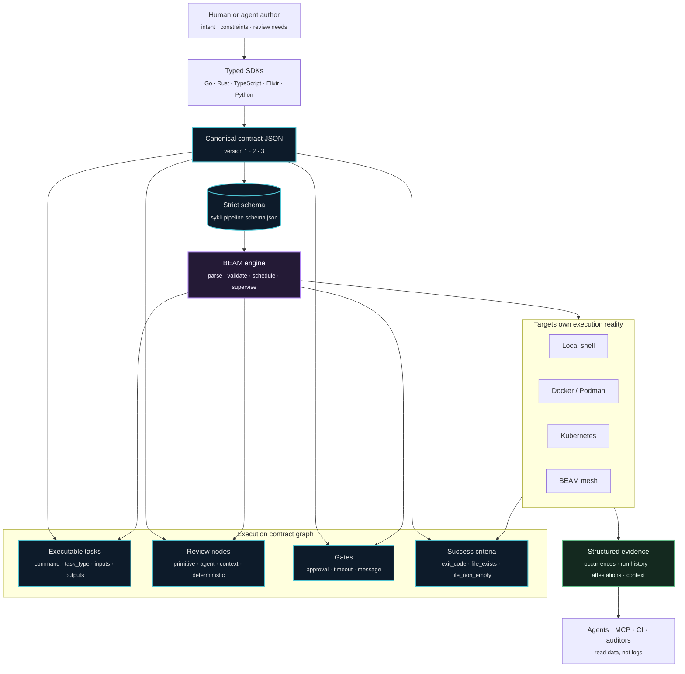

# sykli

**Execution contracts for agent work.**

Sykli turns agentic work into typed, versioned, verifiable execution graphs.

Agents can plan, generate, review, and adapt. But their work still needs
boundaries: what is being run, what it depends on, what environment it needs,
what success means, what evidence it produced, and what another tool can trust
afterward.

Sykli is that boundary.

The goal is not to make every action perfectly deterministic. Agent work can be
nondeterministic by nature. The goal is to make the contract around the action
as deterministic as possible: typed SDKs, canonical JSON, schema validation,
explicit versions, explicit dependencies, declared success criteria, and
structured results.

Sykli makes agent work executable, inspectable, and verifiable without asking
downstream tools to reverse-engineer prompts, YAML, shell commands, or logs.

```go
package main

import sykli "github.com/yairfalse/sykli/sdk/go"

func main() {
    s := sykli.New()

    s.Task("test").
        Run("go test ./...").
        TaskType(sykli.TaskTypeTest).
        Inputs("**/*.go").
        SuccessCriteria(sykli.ExitCode(0))

    s.Task("build").
        Run("go build -o app").
        TaskType(sykli.TaskTypeBuild).
        After("test").
        Output("binary", "app").
        SuccessCriteria(
            sykli.ExitCode(0),
            sykli.FileExists("app"),
        )

    s.Review("review:api-breakage").
        Primitive("api-breakage").
        Agent("local").
        Diff("main...HEAD").
        Context("README.md", "docs/architecture.md").
        After("test")

    s.Emit()
}
```

```
sykli · pipeline.go                                local · 0.6.0

  ●  test     go test ./...                        108ms
  ●  build    go build -o app                      612ms
  ○  review:api-breakage   api-breakage            planned

  ─  2 passed · 1 review planned                   720ms
```

The `review:api-breakage` node is not a shell task. It is a structured review
node in the graph: primitive, agent identifier, context files, dependencies, and
`deterministic: false`.

---

## What problem Sykli solves

Modern software work is increasingly performed by agents, automation, and
remote execution systems, but most pipelines still describe work as shell
commands glued together by YAML.

That leaves the important parts implicit:

- what kind of work a node performs
- what it depends on
- what it is allowed to use
- what environment it needs
- what it is expected to produce
- how success is known
- what should be reviewed by a human or agent
- what evidence downstream tools can trust

Sykli makes those implicit contracts explicit.

A Sykli pipeline is not just a list of commands. It is a versioned execution
contract: a typed graph of executable tasks, review nodes, gates, artifacts,
resources, success criteria, semantic metadata, and structured runtime evidence.

The engine can run the graph, but execution is only one consumer. Agents, CI
systems, auditors, release tooling, and MCP clients can all read the same
contract without reverse-engineering shell scripts or scraping logs.

Sykli's job is to make work understandable before it is executed and verifiable
after it runs.

## sykli is not CI

sykli is not a CI system in the narrow sense.

It is a compiler for execution graphs. Builds, tests, deployments, reviews, release checks, security analysis, and agent-driven reasoning can all be represented as nodes in the same graph. CI is simply the first obvious use case because CI already has the right primitives — tasks, dependencies, inputs, outputs, execution order.

The important shift is that the pipeline is no longer hidden inside YAML and shell scripts. It becomes a real program that emits an explicit, inspectable execution plan.

## Why YAML is not enough

YAML pipelines fail at four things that get worse over time:

- **No types.** A typo in a job name or a wrong parameter type fails at runtime, often inside the cloud provider's job log. There is no compiler.
- **Poor reuse.** Anchors and includes paper over the gap. Real composition — pass values, build helpers, derive task lists from data — is impossible without escape-hatch shell.
- **Hidden logic.** The actual decision tree is split across `if:` conditionals, `needs:` graphs, matrix expansions, environment files, and the runner's behavior. Reading what will run requires running it.
- **Vendor lock-in.** GitHub Actions YAML doesn't run on GitLab, doesn't run on CircleCI, doesn't run on your laptop. The pipeline is property of the vendor, not the project.

A pipeline is a program. Agent work needs a contract.

## How it works



1. **Author.** Write your graph in a real language. Use variables, functions,
   types, and SDK validation.
2. **Emit.** sykli runs your SDK file with `--emit` and reads the resulting JSON. The shape is governed by [`schemas/sykli-pipeline.schema.json`](schemas/sykli-pipeline.schema.json) — the canonical, versioned wire contract.
3. **Execute.** The BEAM engine validates the DAG (cycle detection, schema,
   capability resolution), schedules tasks level-by-level in parallel, applies
   caching and retries, and supervises task execution.
4. **Observe.** Every event becomes a [FALSE Protocol](https://github.com/false-systems) occurrence written to `.sykli/`. AI agents and downstream tools read structured data, not log scrolls.

The engine runs on the BEAM VM. Same code on your laptop, in Docker, on Kubernetes, or across a mesh of nodes.

**Wire-format versions are explicit**, not advisory: `"1"` baseline graphs, `"2"` adds resources/containers/mounts, `"3"` adds agent-native semantic fields starting with `task_type`. SDKs auto-detect from features used, and the engine rejects missing, malformed, or unsupported versions. See [`docs/sdk-schema.md`](docs/sdk-schema.md) for the field-by-field contract.

## Why BEAM matters

Sykli is not "a CLI written in Elixir." Sykli uses BEAM because agent execution
is naturally distributed, concurrent, and failure-heavy work. The VM gives the
engine the same shape as the problem.

Agent work is not a single command. It is a graph of concurrent, failure-prone,
partially remote work: tasks run in parallel, reviews may be nondeterministic,
services need supervision, mesh nodes appear and disappear, retries must be
isolated, and results must stay structured.

BEAM gives Sykli the right substrate:

- **Lightweight processes** for graph nodes, watchers, services, agents, and
  background coordinators.
- **Supervision trees** so task failures become structured events instead of
  process-wide crashes.
- **Message passing** for coordination without shared mutable state.
- **Distribution primitives** for mesh execution without a separate control
  plane.
- **Fault isolation** between tasks, runtimes, agents, and background services.
- **Long-running daemons** that can coordinate local, remote, and CI-triggered
  work.
- **Deterministic simulation hooks** around time, randomness, and transport
  boundaries.

Sykli uses BEAM to make agent execution boring: concurrent by default,
supervised by default, observable by default.

## Distributed-by-default. Deterministic where possible.

Two properties that pipelines normally trade against each other — running across a fleet, and replaying byte-identically — both fall out of how the engine is built.

- **Mesh execution without a control plane.** Cluster one sykli node onto another and either can pick up the other's tasks. No broker, no separate orchestration tier. The engine *is* the coordinator. `--mesh` and `sykli daemon start` are the user surface; capability-based placement (`requires("gpu")`) routes work to nodes that can run it.
- **Deterministic boundaries.** Time, randomness, and I/O are routed through
  transport APIs where possible. A custom lint (`NoWallClock`) fails on raw
  `System.monotonic_time` or `:rand.uniform` so deterministic boundaries do not
  drift.
- **Supervision = retry semantics.** Each task runs under its own supervisor. A crashed task doesn't take the run with it; the engine sees structured exit and decides to retry, skip, or fail-and-analyze based on the task's `on_fail` declaration.

The substrate is not incidental. BEAM is what makes a single-process distributed
runtime and supervised graph executor possible without bolting on a second
clustering layer.

## Agentic review as code

SYKLI Reviews are experimental. A review node represents a structured review step in the execution graph; it does not yet run Codex, Claude, or any other provider directly. It models the review step so future runners can execute agents in a controlled, inspectable way.

Builders are available in **all five SDKs** (Go, Rust, TypeScript, Elixir, Python) with byte-equivalent JSON output. The schema rejects task-execution fields (`command`, `outputs`, `services`, `mounts`, `k8s`, `retry`, `timeout`, `task_type`, `success_criteria`) on review nodes — review primitives and shell tasks have separate, non-overlapping surfaces.

Agentic workflows need primitives, not prompts. Asking an LLM to "review this PR" is too underspecified to be repeatable. Defining a review node with constrained context, dependencies, and explicit primitive semantics is.

```go
s.Review("review:api-breakage").
    Primitive("api-breakage").
    Agent("local").
    Diff("main...HEAD").
    Context("README.md", "docs/architecture.md").
    After("test")
```

A review primitive is a node with:

- **Constrained inputs.** A diff range, a directory, a manifest. Not "the whole repo, figure it out."
- **Explicit rules.** What counts as an api breakage, what counts as a coverage gap, what counts as an architecture-boundary violation.
- **Separate semantics.** Review nodes do not pretend to be shell tasks and do
  not emit task outputs in the current canonical contract.

Task nodes model deterministic work such as build and test commands. Review nodes model non-deterministic evaluation work such as agent review; they are `deterministic: false` by default.

Agents — local tools, hosted models, or deterministic linters — are executors inside the graph. Different runtimes can fulfill the same primitive. The graph is the contract; the executor is an implementation detail.

Planned primitives: `security-boundaries`, `api-breakage`, `behavior-regression`, `test-coverage-gap`, `architecture-boundary`. Provider calls, prompt templates, and review-result occurrences are future work.

## Use cases

| Use case | What sykli gives you |
|---|---|
| **Agentic workflows** | Agents are executors; the graph defines what runs, what it depends on, and what evidence it produces |
| **PR reviews** | Reviews as graph nodes — agents and linters fulfill the same node contract |
| **Release checks** | SLSA v1.0 provenance attestations per task, signed by the engine, verifiable downstream |
| **Security validation** | Secret-scoped tasks, OIDC token exchange to cloud providers, SSRF-guarded webhooks |
| **Infrastructure validation** | Same task graph against `local`, `k8s`, or a self-hosted mesh of nodes |
| **CI pipelines** | The whole CI graph as code, content-addressed cache, parallel-by-dependency-level execution, deterministic boundaries |

## Design principles

- **Real languages, not DSLs.** Pipelines are Go / Rust / TypeScript / Elixir / Python programs.
- **Explicit dependencies.** No implicit ordering, no hidden state. The DAG is the source of truth.
- **Typed APIs.** Each SDK is type-checked by its host language; cross-SDK behavior is enforced by a conformance suite.
- **Portable execution.** Same graph on a laptop, in Docker, on Kubernetes, or across a mesh.
- **Local-first.** The engine runs on hardware you control. Network features are additive, never required.
- **No YAML-first.** YAML is a *projection* of the graph for tools that need it, never the source of truth.
- **Agents are executors, not magic.** A review primitive is a node with constrained context and explicit semantics. Whatever fulfills the contract — agent, linter, classifier — is interchangeable.
- **Determinism is a boundary.** Sykli constrains nondeterministic work with typed APIs, explicit contracts, and structured results.

---

## Install

```bash
curl -fsSL https://raw.githubusercontent.com/yairfalse/sykli/main/install.sh | bash
```

Or [download a binary](https://github.com/yairfalse/sykli/releases/latest) for macOS (Apple Silicon / Intel) or Linux (x86_64 / ARM64).

<details>
<summary>Build from source</summary>

```bash
git clone https://github.com/yairfalse/sykli.git && cd sykli/core
mix deps.get && mix escript.build
sudo mv sykli /usr/local/bin/
```
Requires Elixir 1.14+.
</details>

### Pick your SDK

| Language | Install | File |
|----------|---------|------|
| **Go** | `go get github.com/yairfalse/sykli/sdk/go@latest` | `sykli.go` |
| **Rust** | `sykli = "0.6"` in Cargo.toml | `sykli.rs` |
| **TypeScript** | `npm install sykli` | `sykli.ts` |
| **Elixir** | `{:sykli_sdk, "~> 0.6.0"}` in mix.exs | `sykli.exs` |
| **Python** | `pip install sykli` | `sykli.py` |

All SDKs share the same API surface. The file lives at the project root.

---

## Capabilities

```go
// Content-addressed cache
s.Task("test").Run("go test ./...").Inputs("**/*.go", "go.mod")

// Containers + cache mounts
s.Task("build").
    Container("golang:1.22").
    Mount(s.Dir("."), "/src").
    MountCache(s.Cache("go-mod"), "/go/pkg/mod").
    Workdir("/src").
    Run("go build -o app")

// Matrix expansion
s.Task("test").Run("go test ./...").Matrix("go", "1.21", "1.22", "1.23")

// Gates (approval points)
s.Gate("approve-deploy").Message("Deploy?").Strategy("prompt")
s.Task("deploy").Run("./deploy.sh").After("approve-deploy")

// Artifact passing between tasks
build := s.Task("build").Run("go build -o /out/app").Output("binary", "/out/app")
s.Task("deploy").InputFrom(build, "binary", "/app/bin").Run("./deploy.sh /app/bin")

// Capability-based placement
s.Task("train").Requires("gpu").Run("python train.py")

// Conditional execution
s.Task("deploy").Run("./deploy.sh").When("branch == 'main'").Secret("DEPLOY_TOKEN")
```

---

## CLI

```bash
sykli                     # run pipeline
sykli --filter=test       # run matching tasks
sykli --timeout=5m        # per-task timeout
sykli --mesh              # distribute across mesh
sykli --target=k8s        # run on Kubernetes
sykli --runtime=podman    # pick a container runtime

sykli init                # generate SDK file (auto-detects language)
sykli validate            # check graph without running
sykli plan                # dry-run, git-diff-driven task selection
sykli delta               # only tasks affected by git changes
sykli watch               # re-run on file changes
sykli explain             # show last run as AI-readable report
sykli fix                 # AI-readable failure analysis with source context
sykli context             # generate AI context file (.sykli/context.json)
sykli query               # query pipeline, history, and health data
sykli graph               # mermaid / DOT diagram of the DAG
sykli verify              # cross-platform verification via mesh
sykli history             # recent runs
sykli report              # show last run summary with task results
sykli cache stats         # cache hit rates
sykli daemon start        # start a mesh node on this host
sykli mcp                 # MCP server (Claude Code, Cursor, Copilot)
```

---

## Runtimes

`Docker`, `Podman` (rootless), `Shell` (no isolation), `Fake` (deterministic, used for tests). Auto-detect picks the first available; override per invocation:

```bash
SYKLI_RUNTIME=podman sykli
sykli --runtime=podman
```

Selection priority and how to add a new runtime: [docs/runtimes.md](docs/runtimes.md).

---

## .sykli/ — what lands on disk

```
.sykli/
├── occurrence.json       # latest run, FALSE Protocol structured event
├── attestation.json      # DSSE envelope with SLSA v1.0 provenance (per-run)
├── attestations/         # per-task DSSE envelopes (for artifact registries)
├── occurrences_json/     # per-run JSON archive (last 20)
├── context.json          # pipeline structure + health (via `sykli context`)
└── runs/                 # run history manifests
```

This is the layer agents and downstream tools read. No log parsing, no regex, no scraping the runner UI.

---

## Project status

| Component | Status |
|-----------|--------|
| Core engine, all 5 SDKs (Go/Rust/TS/Elixir/Python), local execution, containers, FALSE Protocol output, canonical schema, GitHub-native receiver (App + webhook + Checks API) | **Stable** |
| Mesh distribution, K8s target, gates, SLSA attestations, remote cache (S3), review-node graph support across all SDKs, `task_type` and `success_criteria` (v3 semantic contract) | **Beta** |
| Review primitive implementations (security/api-breakage/coverage agents), multi-agent execution, structured review outputs | **In development** |

---

## Roadmap

- **Review primitives** — `review/security`, `review/api-breakage`, `review/observability-regression`, `review/test-coverage-gap`, `review/architecture-boundary` as first-class graph nodes
- **Structured review outputs** — typed JSON schema per primitive, consumable by other graph nodes
- **Multi-agent execution** — multiple executors fulfilling the same primitive, with disagreement surfaced as graph state
- **GitHub-native integration** — App + webhook receiver running on the user's mesh, replacing the in-Actions integration
- **FALSE Protocol output compatibility** — already the internal event model; expanding the public schema for downstream consumers

---

## Contributing

MIT licensed.

```bash
cd core
mix test                  # unit + integration tests
mix credo                 # lint, includes the NoWallClock check
mix escript.build         # build the binary

test/blackbox/run.sh      # black-box suite against the built binary
tests/conformance/run.sh  # cross-SDK JSON-output conformance
```

See [CLAUDE.md](CLAUDE.md) for architecture notes, conventions, and the design rationale behind the engine.

---

<div align="center">

**sykli** (Finnish: *cycle*) — built in Berlin, powered by BEAM.

**[Install](#install)** · **[Schema](schemas/sykli-pipeline.schema.json)** · **[Contract](docs/sdk-schema.md)** · **[Issues](https://github.com/yairfalse/sykli/issues)**

</div>
