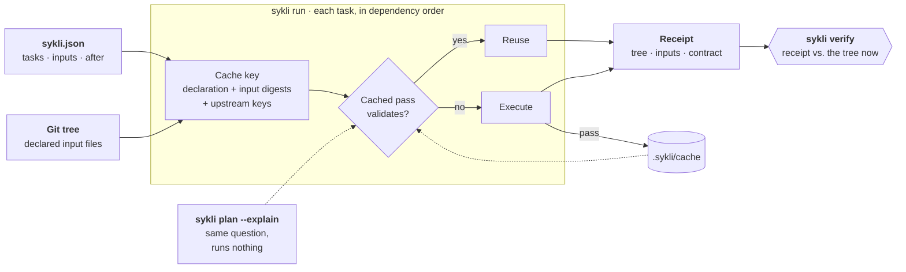

<h1 align="center">sykli</h1>

<p align="center"><em>sykli</em> — Finnish for <em>cycle</em></p>

<p align="center"><strong>Run your checks. Reuse the work. Explain the result.</strong></p>

<p align="center">
  
  
  
  
</p>

<p align="center">
  <a href="#see-it-in-30-seconds">Demo</a> ·
  <a href="#start-in-your-repository">Quick start</a> ·
  <a href="#how-it-works">How it works</a> ·
  <a href="#in-ci">CI</a> ·
  <a href="docs/agents.md">Agents</a> ·
  <a href="#command-map">Commands</a>
</p>

Sykli is one binary that turns your repository's checks into a **declared
graph**. It runs the graph in order, **reuses** any result whose inputs haven't
changed, and writes a **receipt** that ties every outcome to the exact tree it
ran against. It works the same on your laptop, in CI and for a coding agent.

Keep Cargo, npm, Go and your shell scripts. Sykli doesn't replace your tools. It
decides which of them need to run and keeps a verifiable record of what did.

## See it in 30 seconds

Two tasks, `lint` then `test`, each reading one script. Real output, hashes shortened:

```console
$ sykli run
running: lint
lint passed
passed: lint
running: test
tests passed
passed: test
receipt: …/.sykli/receipts/rcpt_4a80a5dc….json

$ sykli run                                   # nothing changed: nothing runs
cached: lint
cached: test
receipt: …/.sykli/receipts/rcpt_efdf9834….json

$ echo 'echo tests passed, again' > test.sh
$ sykli plan --explain                        # what would a run cost now?
lint
  selected: all tasks requested
  cache: available; receipt rcpt_4a80a5dc….json (restoration not attempted)
test
  selected: all tasks requested
  cache: no entry for the current key
Input coverage against 435c318a… (plus --changed hints):
  declared input: "test.sh" -> test
Unmapped paths are advisory except for missing Cargo inputs, which block execution and cache reuse.

$ sykli run --json > .sykli/receipt.json      # only the changed task runs
cached: lint
running: test
tests passed, again
passed: test

$ sykli verify .sykli/receipt.json --contract sykli.json
ok: schema sykli-receipt.v1
ok: contract 8d0e65a0…
ok: tree 777d2ada…
ok: inputs e533f926…
ok: records consistent
ok: outcome passed with 2 task records
verified: receipt matches this tree and contract

$ echo 'echo sneaky' > lint.sh                # change the code after the fact…
$ sykli verify .sykli/receipt.json --contract sykli.json
ok: schema sykli-receipt.v1
ok: contract 8d0e65a0…
mismatch: tree expected a07b2a09… but got 777d2ada…
mismatch: inputs expected 834ffc9b… but got e533f926…
$ echo $?
3
```

Once the code changes, the old receipt no longer verifies. The whole graph is
[below](#a-graph-you-can-try); copy it and try this yourself.

## Start in your repository

Install from source with Rust 1.85 or newer:

```sh
cargo install --git https://github.com/false-systems/sykli --branch main --locked sykli
```

Then, in an existing Cargo, npm or Go repository:

```sh
sykli init                                        # detect ecosystems, write sykli.json, pin it in sykli.lock
sykli plan --explain                              # see selection and cache evidence, run nothing
sykli run --json > .sykli/receipt.json            # run the graph, keep the receipt
sykli verify .sykli/receipt.json --contract sykli.json
```

`init` creates `.sykli/` for local state and adds it to `.gitignore`. Review the
inputs it declares, especially configuration and fixtures, and declare files you
add later. Task execution needs Git, a POSIX `sh` and your project's own
toolchain. On Windows, Git for Windows supplies `sh`.

> [!NOTE]
> This README describes `main`. For a reproducible install, replace
> `--branch main` with `--rev COMMIT`. Tagged downloads will be listed on the
> [releases page](https://github.com/false-systems/sykli/releases) once
> published, and [install.sh](install.sh) verifies their checksums. Installing
> Sykli does not install your build tools.

## How it works


```mermaid
flowchart LR
    contract["<b>sykli.json</b><br/>tasks · inputs · after"]
    tree["<b>Git tree</b><br/>declared input files"]
    cache[(".sykli/cache")]

    subgraph run["sykli run · each task, in dependency order"]
        key["Cache key<br/>declaration + input digests<br/>+ upstream keys"]
        hit{"Cached pass<br/>validates?"}
        reuse["Reuse"]
        exec["Execute"]
        key --> hit
        hit -- yes --> reuse
        hit -- no --> exec
    end

    receipt["<b>Receipt</b><br/>tree · inputs · contract"]
    verify{{"<b>sykli verify</b><br/>receipt vs. the tree now"}}
    plan["<b>sykli plan --explain</b><br/>same question,<br/>runs nothing"]

    contract --> key
    tree --> key
    reuse --> receipt
    exec --> receipt
    receipt --> verify
    exec -- pass --> cache
    cache -.-> hit
    plan -.-> hit
```

It comes down to three things:

| | What it is | Where it lives |
|---|---|---|
| **Contract** | The work you declare: tasks, commands, the files each one reads, and what runs `after` what. | `sykli.json`, pinned by `sykli.lock` |
| **Receipt** | One evaluation: commands, outcomes, output digests, and which results were reused. | `.sykli/receipts/` (and wherever you redirect `--json`) |
| **Verify** | A check that a receipt is consistent with the tree and contract in front of you. | `sykli verify` |

**Reuse is earned, not assumed.** A task's cache key covers its declaration,
the contents and execute bits of its declared inputs, the runtime fingerprint,
digests of inherited environment values, and the cache keys of every task it
runs `after`. A downstream task never reuses a pass recorded against upstream
outputs it did not see, and a matching entry must validate before it is used.

### A graph you can try

In a scratch Git repository:

```sh
printf 'echo lint passed\n' > lint.sh
printf 'echo tests passed\n' > test.sh
```

```json
{
  "schema": "sykli-contract.v1",
  "tasks": [
    { "name": "lint", "run": "sh lint.sh", "inputs": ["lint.sh"] },
    { "name": "test", "run": "sh test.sh", "inputs": ["test.sh"], "after": ["lint"] }
  ]
}
```

`inputs` names the files a task reads. `after` makes `test` wait for `lint` and
binds its cache key to that dependency. Independent tasks run in parallel.

Every path a task declares (`inputs`, `outputs`, `workdir`) is relative to the
repository and stays inside it. Absolute paths and `..` are refused when the
contract is validated, before anything runs, so a receipt is always a claim
about the repository it sits in. `sykli validate` checks a contract without
running it.

<details>
<summary><strong>What a task sees when it runs</strong></summary>

<br>

Tasks run under `sh -c` with no stdin. They receive `PATH`, `HOME` and `TMPDIR`,
plus declared `env` values and named `inherit` variables. Inherited values reach
the task, but only their digests reach the receipt, where they count toward the
task's identity. Task output is captured, so commands are responsible for what
they print. Sykli runs local commands with your permissions.

</details>

## Ask before you run

`plan --explain` tells you what a run would do and what the cache can supply,
without running anything:

```sh
sykli plan --explain
sykli plan --changed test.sh --explain
sykli plan --changed test.sh --explain --json
sykli plan --explain --base origin/main --json
sykli plan --explain --preview --json          # inspect a contract edit before re-locking
```

It reads `sykli.json` by default; an explicit JSON contract path selects another
graph. It runs no task or Rust emitter, restores no outputs, and writes no cache
entries or receipts.

| Cache state | What it tells you |
|---|---|
| `available` | Cached evidence and artifacts validate; a run can attempt reuse. |
| `missing` | No entry exists for the current content key. |
| `invalid` | An entry exists, but its evidence or artifacts failed validation. |
| `deferred` | A dependency needs execution, restoration or error resolution first. |
| `input_error` | A declared input cannot currently be evaluated. |

**Undeclared files are flagged.** Explain warns about changed files that no task
lists as an input, even when every task is already selected. It checks staged,
unstaged and untracked non-ignored files, and `--base origin/main` adds
committed changes relative to that ref. Contract and lock changes are labeled as
evaluation metadata. In Cargo-root repositories, `run` refuses to execute or
reuse passes when known source, configuration or test files in the current Git
inventory are missing from every task's inputs. Other unmapped paths are advisory.

> [!IMPORTANT]
> Sykli does not observe every file or tool your commands read. An undeclared
> dependency can make a cached result misleading, and selecting every task does
> not prove every dependency is declared. An explanation describes the current
> local evidence, not a guaranteed outcome. See
> [the coverage limits](docs/agents.md).

`--changed` takes paths **you supply** and filters the displayed plan to
matching inputs and their downstream tasks. It does not discover a Git diff and
does not restrict a later `run`, which evaluates the whole graph and decides
reuse from content keys.

## In CI

After checkout, install Sykli and your project's toolchain, then:

```sh
mkdir -p .sykli
sykli run --json > .sykli/receipt.json
sykli verify .sykli/receipt.json --contract sykli.json
```

Fail the job on either command's nonzero exit and keep the receipt as an
artifact. The included [GitHub Action](action.yml) runs and verifies the graph,
writes a job summary, uploads the receipt, and reports which tasks a pull
request affects. It installs a release tag, so pin it with
`uses: false-systems/sykli@vX.Y.Z` once one is published. This repository gates
itself through the Action on every pull request.

<details>
<summary><strong>Measuring smarter CI: the shadow experiment</strong></summary>

<br>

On pull requests, this repository runs a [shadow experiment](docs/ci-shadow.md).
It records the changed paths and runs the full candidate graph, then compares
that result with the reuse proposed by a separate run of the base commit. It
reports agreements, disagreements, unmapped paths and the task time that could
have been reused.

**All required checks still run.** The experiment measures whether skipping
could be justified later. It does not claim CI savings today, and matching
observations do not prove that declarations are complete.

</details>

## Built for agents

The CLI does the querying, and `--json` gives scripts and agents the same
answers. Every machine-readable document has a versioned schema, and
incompatible changes get a new version. Exit codes are part of each command's
contract and are printed in its `--help`. The loop an agent runs is the one you
run:

```sh
sykli plan --changed PATH --explain --json    # which tasks does this change need?
sykli run --json                              # run them, get a sykli-receipt.v1
sykli verify RECEIPT --contract sykli.json    # does that receipt still describe this tree?
```

Read the [agent guide](docs/agents.md) for selection reasons, JSON fields and
error behavior.

## Beyond checks

### Build artifacts and resume unfinished work

On Linux and macOS, typed production captures declared source, builds an
artifact and runs the required checks. A production ID lets another terminal
or agent resume from the same local store.

```sh
sykli init --production --smoke '"$SYKLI_INPUT_executable" --help'
sykli targets
sykli produce TARGET --stop-after build
sykli resume PRODUCTION_ID
```

Use the target name and production ID that Sykli prints. Stopping after build
exits 1 while checks remain. Artifact availability and completed checks are
recorded separately. Failed work requires an explicit retry, and an unresolved
lost attempt cannot silently become a success. See
[the production agent loop](docs/agents.md) for preparation without execution,
bounded parallel work and diagnostics.

### Inspect pull-request evidence

With an authenticated GitHub CLI (`gh`), collect CI and review evidence for an
exact candidate and assess it against requirements you declare:

```sh
sykli inspect --repo OWNER/REPO --pr NUMBER --requirements review.json
sykli assess BUNDLE --requirements review.json
```

The requirements file names exact workflow and reviewer IDs. Sykli saves the
collected responses, so an assessment can be replayed offline. Each requirement
comes back **established**, **refuted** or **unproven**, with the gaps and
excluded evidence behind it. An approval of an older commit does not count as
approval of the current candidate.

Assessments are advisory. They establish declared review-readiness conditions,
not permission to merge or deploy. `inspect` makes bounded, read-only requests
through `gh`. It never posts reviews or triggers work.

## What a receipt proves, and what it doesn't

`verify` runs in stages, and the first stage that fails decides the exit code:

| Exit | Meaning |
|---|---|
| `0` | Receipt matches, and the work passed or was reused. |
| `1` | The recorded work failed. |
| `2` | The receipt cannot be verified. |
| `3` | The tree or declared inputs changed since the run. |
| `4` | The contract or lock differs. |

A receipt checks record consistency, contract identity, the repository tree and
declared inputs, and then the recorded outcome. It **does not** authenticate who
wrote the receipt, and it does not prove that the declared checks are
sufficient.

A receipt also records **when**. `started_at_ms` on the run is when that run
began; on a task, it is when that task was seen running. A cached task replays
its original moment, so a receipt full of cache hits reports old task times
under a new run time, which is an accurate record of what happened. Neither
field is part of any cache key.

Keep receipts under `.sykli/` or outside the repository, so that they don't
change the tree they describe.

## What Sykli keeps on disk

The cache, the receipts and production scratch are bounded, and each limit is stated:

| State | Limit | Override |
|---|---|---|
| Task cache | **1 GiB**; least recently used entries are dropped when a run would go over | `SYKLI_CACHE_BUDGET_BYTES` (`0` keeps everything) |
| Receipts | **200**; oldest removed first, never one that a live cache entry cites | `SYKLI_RECEIPT_BUDGET` (`0` keeps every receipt) |
| Production attempts | Working directories removed (best effort) once outputs are collected | — |

Both budgets are enforced when a run **starts** as well as when it stores. A
production command first sweeps the working directories of any attempt that no
executor holds, so a run killed mid-attempt is cleaned up by the next one. A
receipt that a live cache entry cites is never evicted, because a cached result
whose receipt is gone would be a claim with nothing behind it. Losing a cache
entry costs a re-run, never a result.

## Command map

| | Command | What it does |
|---|---|---|
| **Graph** | `init` | Detect Cargo, npm and Go; write `sykli.json` and pin it |
| | `validate` | Check a contract without executing it |
| | `lock` | Re-pin a contract's hash in `sykli.lock` after you edit it |
| | `plan` | Select the tasks a change requires; `--explain` shows why and what's cached |
| | `run` | Execute the graph and record a receipt |
| | `verify` | Check a receipt against the current tree and contract |
| **Production** | `targets` | Discover typed artifact targets without building |
| | `produce` | Build an artifact from captured source and run its checks |
| | `status` · `resume` | Inspect or continue a production by ID |
| | `diagnostics` · `verify-production` | Read an attempt's diagnostics; check a production record |
| **Evidence** | `inspect` | Collect a pull request's runs and reviews through `gh` |
| | `assess` | Assess a saved evidence bundle, offline and deterministically |

Every command documents its flags and exit codes in `sykli <command> --help`.

## Learn more

- [Agent guide](docs/agents.md): JSON queries, explanations, production and assessment
- [CI experiment](docs/ci-shadow.md): methodology, artifacts and limitations
- [Changelog](CHANGELOG.md): version history
- [Contributing](CONTRIBUTING.md) and [product boundaries](AGENTS.md)
- [Security policy](SECURITY.md): report vulnerabilities privately

<p align="center"><sub>Part of False Systems · <a href="LICENSE">MIT</a></sub></p>
