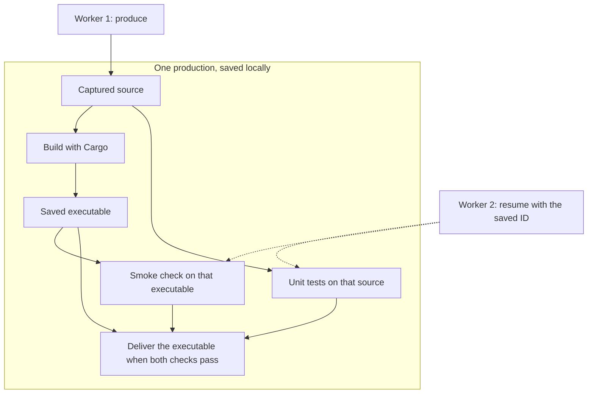

# sykli

**Build an artifact. Keep the progress.**

Sykli runs your build and tests, saves the resulting artifact, and records which
source and checks belong to it. If you stop halfway through, another terminal
or agent can finish the same work from its saved state.

Your build tools still do the building. Sykli keeps track of the inputs, results,
and unfinished work. It runs locally on Linux and macOS, with no account or server.

## Why use it?

A build can outlive the person or agent that started it. When someone picks up
the work, they need to know which source was built, where the executable is,
which checks passed, and what remains. Sykli saves those facts together so the
next worker can inspect them and continue.

A **production** is one target bound to one captured source state and its build
instructions. Commands and workers can come and go; that saved work keeps its
identity. Change the source or instructions and you get a different production.

## How it fits together

Here is the executable example below. The first worker stops after building;
the next worker runs the remaining checks against the saved source and binary.


```mermaid
flowchart TD
    first["Worker 1: produce"] --> source
    next["Worker 2: resume with the saved ID"] -.-> unit
    next -.-> smoke

    subgraph saved["One production, saved locally"]
        source["Captured source"] --> build["Build with Cargo"]
        build --> binary["Saved executable"]
        source --> unit["Unit tests on that source"]
        binary --> smoke["Smoke check on that executable"]
        binary --> delivered["Deliver the executable when both checks pass"]
        unit --> delivered
        smoke --> delivered
    end
```

Sykli records each attempt and its result in `.sykli/production`. `status`
reconstructs progress from those records; `resume` runs work still needed.
The next worker needs the production ID and access to that store. It does not
need a handover explanation or a running Sykli server.

## Install

The artifact and resume commands below require a build from this repository;
the v0.2.0 release does not include them. With Rust and Cargo installed:

```sh
git clone https://github.com/false-systems/sykli.git
cd sykli
cargo install --path . --locked --bin sykli --force
```

Make sure Cargo's bin directory (normally `~/.cargo/bin`) is on your `PATH`.
`--force` replaces an existing Cargo-installed Sykli.

## Build something

Start in the root of a Cargo workspace that contains a binary. Sykli's generated
commands run offline, so fetch any missing dependencies first with `cargo fetch`.

```sh
sykli init --production --smoke '"$SYKLI_INPUT_executable" --help'
```

This writes **`sykli.production.json`**: a file describing what to build and how
to check it. Review its source-file list and commands before running them.
The generated target is called `app`, regardless of your binary's name.

The `--smoke` command is a quick check of the built executable. The example
checks that `--help` exits successfully. Replace it with a command appropriate
to your program. Sykli sets `$SYKLI_INPUT_executable` to the exact binary it built;
keep the outer single quotes so your current shell does not expand it.

Now look at the plan and build:

```sh
sykli targets --json                                # what can this repo produce?
sykli plan sykli.production.json --target app --json # what will run?
sykli produce app --json                            # build and check it
```

Sykli captures the selected source files, including local edits, then runs:

| Operation | What it does |
| --- | --- |
| `build` | Builds a release executable from the captured source and saves its bytes. |
| `unit_tests` | Runs the selected Cargo package's binary and library unit tests against that source. |
| `smoke_test` | Runs your smoke command against the saved executable. |

Success means the artifact is available and both checks passed. Integration
tests and doctests are not included automatically.

The JSON response includes these fields:

| Field | What you use it for |
| --- | --- |
| `production` | The ID to use when inspecting or resuming this work. |
| `delivery.app.availability.locations[0]` | The path to the executable. Run it directly or copy it where you need it. |
| `delivery.app.artifact.content` | The SHA-256 identity of the executable's bytes. |
| `assessment.satisfied_checks` | The recorded attempts that passed the required checks. |

If your workspace has several binaries, add `--package NAME --bin NAME` to
`init`. A standalone Rust `main.rs` can use `sykli init --production` without
Cargo. Other build tools can be used through an explicit contract; see the
[production guide](docs/production.md).

## Stop now, finish later

For your first build, use this instead of the `produce` command above to stop
after compilation:

```sh
sykli produce app --stop-after build --json
```

This intentionally exits **1**: the executable is saved, but checks remain.
Copy the `production` ID from the response. In a fresh terminal, in the same
repository, replace `PRODUCTION_ID` below with that ID:

```sh
sykli status PRODUCTION_ID --json  # see completed and unfinished work
sykli resume PRODUCTION_ID --json  # run the remaining work
```

Sykli reuses the saved executable and runs the remaining checks. It needs the ID
and the local store at `.sykli/production`, not the previous worker's chat.
Keep that directory. From another directory, pass `--store /path/to/.sykli/production`.
An already-complete production stays complete; `--stop-after` does not undo it.

Editing source and running `produce` creates a new production. `resume` always
uses the original captured source, even if your working files have changed.
Old passing checks cannot complete work for different source or executable bytes.

## When something fails

- **A command failed:** inspect `status`. To retry a failed build explicitly,
  run `sykli resume PRODUCTION_ID --retry build --json`. Earlier attempts stay recorded.
- **You changed the code to fix it:** run `sykli produce app --json` for the new source.
- **Execution is indeterminate:** Sykli cannot establish whether everything stopped.
  It refuses a retry that could overlap surviving work. Continuation is between
  operations; it does not resume a compiler halfway through an instruction.
- **The artifact is missing or no longer executable:** historical checks stay
  recorded, but delivery does not report success.

`produce` and `resume` exit 0 only for successful delivery, 1 for unfinished or
unsuccessful work, and 2 for an error. `status` can exit 0 while showing unfinished
work: it successfully inspected the records.

`sykli verify-production PRODUCTION_ID --json` checks record integrity, bindings,
completion, and current artifact availability. The local executor and store are
trusted. This is not a security sandbox or a proof that the software is correct.
There is no automatic publication, remote execution, or reuse across productions.

## Try the full example

From this checkout, with Python 3 and the installed Sykli on your `PATH`:

```sh
python3 examples/production/demo.py --binary "$(command -v sykli)" --output /tmp/sykli-demo.json
```

It builds a tiny program that prints `42`, exits after compilation, finishes
from a fresh invocation, then changes the source and shows that the old checks
do not make the new version pass. It prints the artifact location and saves
all commands and results in `/tmp/sykli-demo.json`.

## Existing graph workflow

The original task-graph commands still work for Cargo, npm, and Go repositories:

```sh
sykli init                              # write and lock sykli.json
sykli plan --changed src/lib.rs --json  # inspect tasks affected by a change
sykli run --json                        # run the graph and record a receipt
```

This path uses `sykli.json` and its existing cache and receipts. The artifact
workflow above uses `sykli.production.json`. Existing graphs do not automatically
gain artifact validation or continuation.

See [installation options](docs/install.md), the [GitHub Action](docs/github-actions.md),
and the [graph/receipt specification](docs/spec.md) for the existing interfaces.

## Further reading

- [Production contract, storage, and execution limits](docs/production.md)
- [Agent interface](docs/agents.md)
- [Design decisions](docs/adr/) and [local production scope](docs/adr/0009-local-production.md)
- [Contributing](CONTRIBUTING.md), [changelog](CHANGELOG.md), [security](SECURITY.md)

MIT.
