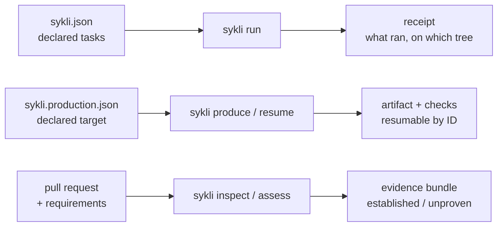

# sykli

**A content-addressed evaluator for declared work graphs.**

Sykli runs the work you declare, binds every result to the exact inputs it was
computed from, and writes that down in versioned JSON. A receipt claims exactly
what ran, never what it meant. Humans and agents read the same records; nothing
is inferred from a chat, and there is no server or account.

It runs locally on Linux, macOS and Windows; typed production is Linux and
macOS only for now. One binary, three surfaces:

| Surface | You declare | Sykli records |
| --- | --- | --- |
| [Graph runs](#graph-runs-and-receipts) | Tasks, their commands and input files (`sykli.json`) | A receipt: which tasks ran on which tree, outcome and outputs |
| [Typed production](#typed-production) | A target: source files, a build, required checks (`sykli.production.json`) | The artifact, the checks that passed, and unfinished work another worker can resume |
| [Pull-request evidence](#see-what-a-change-has-established) | Review-readiness requirements for a repository | A bundle of what GitHub reported and which requirements are established, refuted or unproven |

The common rule: change an input and you get a different identity. Old passing
results never complete work for different bytes.


```mermaid
flowchart LR
    tasks["sykli.json<br/>declared tasks"] --> run["sykli run"] --> receipt["receipt<br/>what ran, on which tree"]
    target["sykli.production.json<br/>declared target"] --> produce["sykli produce / resume"] --> artifact["artifact + checks<br/>resumable by ID"]
    candidate["pull request<br/>+ requirements"] --> inspect["sykli inspect / assess"] --> verdict["evidence bundle<br/>established / unproven"]
```

## Install

Releases from v0.6.0 include all three surfaces. The installer script verifies
the tarball's checksum and places the binary at `~/.local/bin/sykli`:

```sh
curl -fsSLO https://raw.githubusercontent.com/false-systems/sykli/main/install.sh
sh install.sh v0.6.0
```

Or build from source with Rust 1.85 or newer:

```sh
cargo install --git https://github.com/false-systems/sykli --tag v0.6.0 --locked sykli
```

Each release also carries a Windows zip, a Homebrew formula (`sykli.rb`) and
`SHA256SUMS`. The repository's `action.yml` is a GitHub Action that installs the
release matching its ref and runs the graph.

## Graph runs and receipts

Declare the tasks a change requires and their input files. Sykli selects the
tasks a change affects, runs them, caches by content, and writes a receipt.

```sh
sykli init                              # detect Cargo, npm or Go; write and lock sykli.json
sykli plan --changed src/lib.rs --json  # which tasks does this change require?
sykli run --json                        # run the graph and record a receipt
sykli verify receipt.json               # is this receipt about the current tree and contract?
```

`run` exits 0 when every task passed and 1 otherwise. `verify` distinguishes a
failed run (1) from a receipt that no longer matches the tree (3) or the
contract (4). The receipt's subject includes a digest of the declared inputs, so
an undeclared input change cannot pass as the same evaluation.

This repository gates itself this way: a dumb GitHub Action (`action.yml`)
invokes `sykli` and attaches the receipt to the run.

## Typed production

A **production** is one target bound to one captured source state and its build
instructions. Workers can come and go; the saved work keeps its identity.

Start in a Cargo workspace with a binary or a Go module with a main package:

```sh
sykli init --production --smoke '"$SYKLI_INPUT_executable" --help'
sykli targets                                    # what can this repo produce?
sykli plan sykli.production.json --target sykli  # what will run?
sykli produce sykli                              # build and check it
```

`init --production` writes `sykli.production.json`: the source files to
capture, a `build` operation, `unit_tests`, and your `--smoke` check of the
built executable. Review its file list and commands before running them. The
target is named after your binary; substitute it for `sykli` below. Add
`--package NAME --bin NAME` for several Cargo binaries or `--package ./cmd/NAME`
for Go. Generated commands run offline, so fetch dependencies first.

`produce` captures the selected files, including local edits, builds, runs the
checks, and prints where the artifact is and which checks passed. `--json`
returns the full structured record: `production` is the ID to resume with,
`delivery.<target>.availability.locations[0]` the executable's path,
`delivery.<target>.artifact.content` its SHA-256.

### Stop now, finish later

```sh
sykli produce sykli --stop-after build   # exits 1: artifact saved, checks remain
sykli status PRODUCTION_ID               # completed and unfinished work
sykli resume PRODUCTION_ID               # run what remains, reusing the saved executable
```

The next worker needs the production ID and the store at `.sykli/production`
(or `--store DIR`), not the previous worker's chat. `resume` always uses the
captured source, even if your files changed since. Editing source and running
`produce` again creates a new production.

For agents, `--summary --json` on `produce`, `status` and `resume` gives compact
state with `ready` work and no embedded logs; `--operation NAME` runs one
operation whose inputs are satisfied; `--retry NAME` re-runs a failed one
explicitly; `sykli diagnostics PRODUCTION_ID ATTEMPT_ID` fetches recorded output
on demand. The loop is written out in the [agent interface](docs/agents.md).

`produce` and `resume` exit 0 only for successful delivery, 1 for unfinished or
failed work, 2 for an error. `sykli verify-production PRODUCTION_ID` checks record
integrity, bindings, completion and current artifact availability. The local
executor and store are trusted: this is not a sandbox or a proof of correctness.

## See what a change has established

Read a pull request's workflow runs and reviews through your existing `gh`
login, save them as an immutable evidence bundle, and see which declared
conditions are established, refuted or still unproven, and why.

```sh
sykli inspect --repo OWNER/NAME --pr 25                              # observations, no verdict
sykli inspect --repo OWNER/NAME --pr 25 --requirements review.json   # assess declared requirements
sykli assess .sykli/evidence/COLLECTION_ID --requirements review.json --why review
```

```text
0e1982a… — UNPROVEN
Scope: declared review-readiness conditions; advisory

✓ ci      GitHub reports success for the required workflow
? review  No allowed reviewer has approved this candidate

Trust: local collector and store; receipt is not authenticated
```

Requirements are a small content-addressed file naming exact workflow and
account IDs; two predicates exist today, provider-reported workflow success and
approval of the exact head commit. Exit codes: 0 established, 1 refuted,
3 unproven, 4 conflict, 2 invalid input or tool failure. `assess` replays a
saved bundle offline and gives the same answer for the same bundle, requirements
and time.

It is read-only and advisory. Nothing is merged, triggered, posted or certified,
and every result names its trust limit; `sykli inspect --help` lists the exit codes.

## What sykli will not do

No server, daemon, webhook or coordination. No agent execution. No claim about
what a result means beyond the declared predicate. `AGENTS.md` states the
boundaries and what does not come back without a named user.

## Further reading

- [Agent interface](docs/agents.md)
- [Contributing](CONTRIBUTING.md), [changelog](CHANGELOG.md), [security](SECURITY.md)

MIT.
