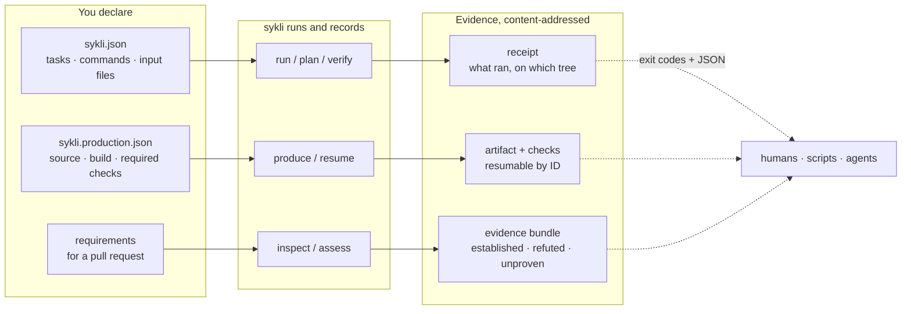

<h1 align="center">sykli</h1>

<p align="center"><strong>Know what actually ran. Not what someone says ran.</strong></p>

<p align="center">
  
  
  
  
</p>

sykli is a content-addressed evaluator for declared work: a small command-line
tool that runs the commands you name in a repository and writes a **receipt**
binding each result to the exact files, contract and command it came from.
Anyone, human or agent, can later ask whether a receipt is still true for the
code in front of them. It is available as a single binary for Linux, macOS and
Windows.

sykli is not a CI service, a task tracker or an agent runner. It sits under the
tools you already use (cargo, npm, go, your CI runner) and in front of the
people and agents who need to trust their results without re-doing them or
taking a summary on faith.


```mermaid
flowchart LR
    subgraph declare["You declare"]
        contract["sykli.json<br/>tasks · commands · input files"]
        target["sykli.production.json<br/>source · build · required checks"]
        rules["requirements<br/>for a pull request"]
    end
    subgraph engine["sykli runs and records"]
        run["run / plan / verify"]
        produce["produce / resume"]
        inspect["inspect / assess"]
    end
    subgraph evidence["Evidence, content-addressed"]
        receipt["receipt<br/>what ran, on which tree"]
        artifact["artifact + checks<br/>resumable by ID"]
        verdict["evidence bundle<br/>established · refuted · unproven"]
    end
    contract --> run --> receipt
    target --> produce --> artifact
    rules --> inspect --> verdict
    receipt -. "exit codes + JSON" .-> readers["humans · scripts · agents"]
    artifact -.-> readers
    verdict -.-> readers
```

## Getting started

- [Install](#install) the binary, then in any Cargo, npm or Go repository:
  `sykli init && sykli run`.
- Read the thirty-second walkthrough below to see what a receipt is.
- Three situations sykli is built for: [run checks and get a receipt](#1-run-your-checks-and-get-a-receipt),
  [build, stop, let someone else finish](#2-build-something-stop-let-someone-else-finish),
  [ask whether a pull request is ready](#3-ask-whether-a-pull-request-is-actually-ready).
- Driving sykli from an agent: [docs/agents.md](docs/agents.md). Every command
  documents its flags and exit codes under `--help`.

### Thirty seconds, end to end

A repository with two checks. The file is `sykli.json`; `sykli init` writes one
like it for Cargo, npm and Go projects.

```json
{"schema":"sykli-contract.v1","tasks":[
  {"name":"lint","run":"grep -qv TODO src.txt","inputs":["src.txt"]},
  {"name":"test","run":"sh test.sh","inputs":["src.txt","test.sh"],"after":["lint"]}]}
```

```sh
$ sykli run --json > .sykli/receipt.json
running: lint
passed: lint
running: test
passed: test
```

The receipt, trimmed:

```json
{
  "schema": "sykli-receipt.v1",
  "contract_hash": "c5a2bbbde46a…",
  "subject": { "tree_oid": "596e8c346e48…", "inputs_digest": "9daed25e15ee…", "dirty": false },
  "tasks": [
    { "name": "lint", "command": "grep -qv TODO src.txt", "outcome": "passed", "exit_code": 0, "stdout_digest": "e3b0c44298fc…" },
    { "name": "test", "command": "sh test.sh",            "outcome": "passed", "exit_code": 0, "stdout_digest": "e3b0c44298fc…" }
  ],
  "outcome": "passed"
}
```

Every field is a fact, not a summary: which tree, which declared inputs, which
contract, which command, which exit code, a digest of what it printed. Check
it, then change a file and check again:

```sh
$ sykli verify .sykli/receipt.json
verified: receipt matches this tree and contract        # exit 0
$ echo "// TODO" >> src.txt
$ sykli verify .sykli/receipt.json
mismatch: tree expected 596e8c34… but got 21fa0d9e…     # exit 3: the code moved on
```

Run again and only what the change touched runs; the rest comes from a
content-addressed cache and is marked `cached` in the new receipt.

Three words cover the model. A **contract** is the JSON file: tasks, commands,
the files they read, `after` for ordering, nothing else. A **receipt** is what
one run established, bound by hashes to the exact tree, inputs and contract.
**Verify** is the question "is this receipt still true here?", answered with an
exit code: 0 yes, 1 the work failed, 3 the code changed, 4 the contract
changed, 2 that is not a valid receipt.

## Features

- **Content-addressed everything.** Contracts, receipts, inputs, artifacts and
  saved evidence are named by the hash of their bytes. One byte different is a
  different identity and a different result. No "latest", no timestamps to
  trust.
- **Delta planning and caching.** `sykli plan --changed PATH` names the tasks
  a change requires; unchanged work is served from cache, and a task never
  inherits a pass recorded against inputs it did not see.
- **Resumable typed production.** Capture source, build an artifact, run
  required checks, stop at any boundary; another worker resumes by ID from the
  saved records, without the previous worker's conversation. Linux and macOS.
- **Pull-request evidence.** Read a PR's CI runs and reviews through your `gh`
  login into an immutable bundle and assess your own declared requirements
  against the exact head commit, offline and reproducibly. Advisory: nothing
  is merged, triggered, posted or certified.
- **One interface for humans, scripts and agents.** Readable text on the
  screen, one versioned `sykli-*.v1` JSON document on stdout with `--json`, and
  fixed exit codes for every command.
- **Honest about limits.** A receipt says what ran, never what it meant. Every
  assessment prints its trust boundary. `verify` proves consistency with the
  tree and contract, not who wrote the receipt.

## Three situations

### 1. Run your checks and get a receipt

The walkthrough above, for real projects. `init` detects the ecosystem and
writes the contract; `run` executes only what a change affects and records the
result; `verify` checks a receipt against the code in front of you.

```sh
sykli init                                   # detects Cargo, npm or Go; writes sykli.json, ignores .sykli/
sykli run --json > .sykli/receipt.json       # runs the graph; the receipt lives outside the tree it describes
sykli verify .sykli/receipt.json             # is this receipt still true for the tree in front of me?
```

Tasks see only `PATH`, `HOME` and `TMPDIR` unless they declare `env` values or
`inherit` named variables; inherited values reach the command, and only their
digests reach the receipt. Run `verify` where the receipt was produced, as the
GitHub Action does, or sign receipts before trusting them across a boundary.

### 2. Build something, stop, let someone else finish

Declare a target: the source files, the build, the checks that must pass.
sykli captures the source, builds, runs the checks, and saves the artifact with
its identity. Stop early and another terminal or agent resumes with one ID.

```sh
sykli init --production --smoke '"$SYKLI_INPUT_executable" --help'
sykli produce sykli --stop-after build    # exits 1: built, checks remain
sykli resume PRODUCTION_ID                # someone else finishes the checks
```

The next worker needs the ID and the local store, not a conversation. Edit the
source and you get a new production; old passing checks never count for new
bytes. A lost attempt can be abandoned explicitly and retried; nothing is ever
marked done that did not run.

### 3. Ask whether a pull request is actually ready

Point sykli at a pull request. It reads the CI runs and reviews through your
existing `gh` login, saves what GitHub said as an immutable bundle, and tells
you which of *your* requirements are established, refuted, or still unproven,
and why.

```sh
sykli inspect --repo false-systems/sykli --pr 25 --requirements review.json
```

```text
0e1982a… — UNPROVEN
Scope: declared review-readiness conditions; advisory

✓ ci      GitHub reports success for the required workflow
? review  No allowed reviewer has approved this candidate

Trust: local collector and store; receipt is not authenticated
```

Requirements are a small file naming exact workflow and reviewer IDs. An
approval on an older commit does not count. A newer failing run hides an older
green one. A run from a fork or a different workflow is excluded and says so.
`sykli assess BUNDLE` replays a saved bundle later, offline, to the same answer.

## Install

```sh
curl -fsSLO https://raw.githubusercontent.com/false-systems/sykli/main/install.sh
sh install.sh v0.6.0
```

Or `cargo install --git https://github.com/false-systems/sykli --tag v0.6.0 --locked sykli`
with Rust 1.85 or newer. Each release carries tarballs for Linux and macOS
(x86_64 and aarch64), a Windows x86_64 zip, a Homebrew formula and
`SHA256SUMS`. `action.yml` in this repository is a GitHub Action that installs
the release matching its ref and runs the graph.

## Runtime requirements

- `git`, for the tree identity every receipt is bound to.
- A POSIX `sh` on `PATH` to run tasks; on Windows, Git for Windows provides one.
- For typed production: Linux or macOS, and the toolchain your target uses.
- For pull-request evidence: the GitHub CLI (`gh`), logged in. sykli never
  stores credentials.

## Releases and API stability

Every machine-readable document carries a versioned schema (`sykli-contract.v1`,
`sykli-receipt.v1`, `sykli-assessment.v1`, …). A schema's meaning never
changes once published; additions are optional fields, and anything
incompatible is a new version. Exit codes are part of the interface and are
listed in each command's `--help`. Releases are tagged `vX.Y.Z` and built by
the release workflow from that tag; see the [changelog](CHANGELOG.md).

## Communication

Issues and pull requests on this repository. Read [CONTRIBUTING.md](CONTRIBUTING.md)
first: sykli is small on purpose, and [AGENTS.md](AGENTS.md) lists what it will
not become.

## Reporting security issues

See [SECURITY.md](SECURITY.md). Please do not open public issues for
vulnerabilities.

## License

MIT. See [LICENSE](LICENSE).

## Project details

- Boundaries: no server, daemon, webhook or coordination; no agent execution;
  no interpretation of results beyond the declared predicate. Removed
  capabilities do not return without a named user ([AGENTS.md](AGENTS.md)).
- Documentation: this page, `sykli <command> --help`, and
  [docs/agents.md](docs/agents.md) for driving sykli from an agent.
- Part of the False Systems family of tools; sykli supplies the evidence that
  work-tracking and gating tools reason about, and nothing else.
