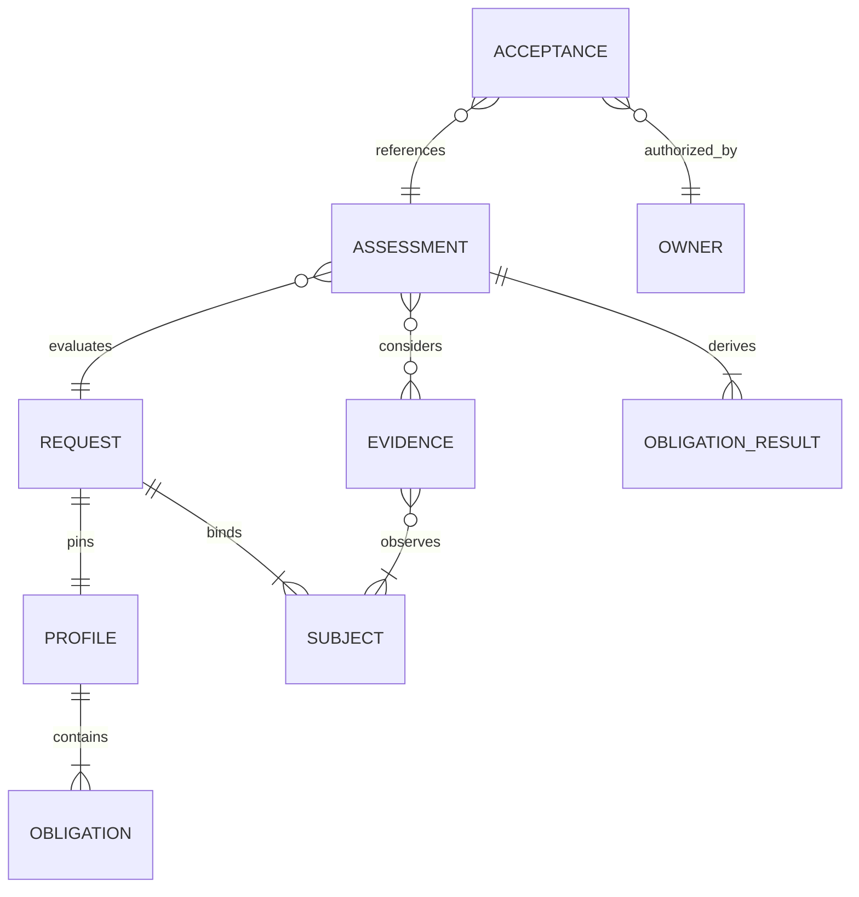
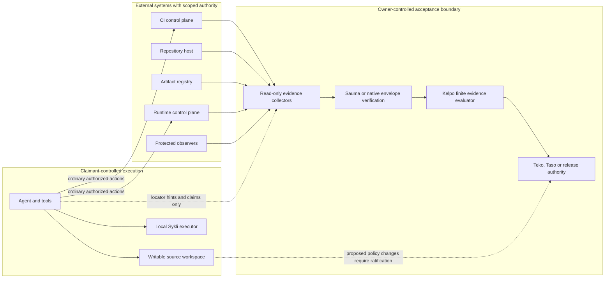
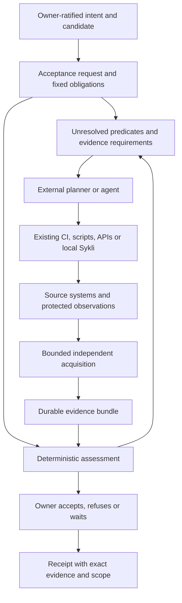
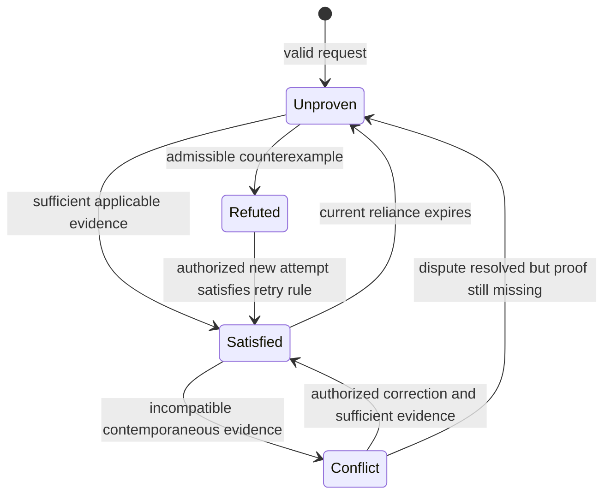
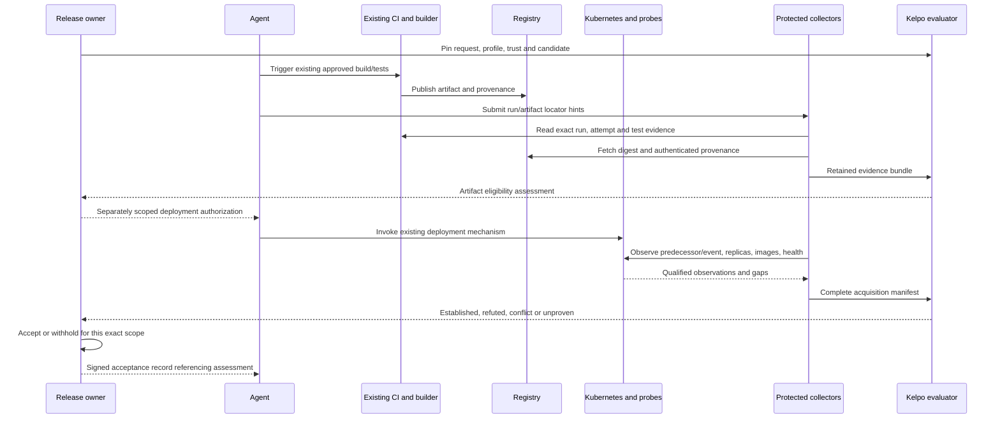

# After pipelines: evidence-bound acceptance

Design investigation · 2026-09-08 · proposal, not an accepted ADR or implemented API

This document answers Yair's first-principles brief. It does **not** authorize a
migration, reinterpret existing receipts, or change any sibling's authority.
Commands and formats explicitly marked *proposed* do not exist today.

**Direction update, 2026-09-09:** Yair requires Sykli to be a standalone
open-source product. The [standalone CI evidence design](standalone-ci-evidence.md)
supersedes this document's recommendation to put the new product in Kelpo and
its proposed CLI/MVP. This investigation remains the supporting code, trust and
prior-art analysis. Its family ownership recommendations are historical, not a
dependency requirement for the new design.

## A. Executive thesis

**The useful replacement for a pipeline at the acceptance boundary is a pinned
acceptance request: a particular subject, a desired condition, and the evidence
standard under which an owner will accept it.** Obligations are the predicates
inside that request. They are not another list of commands.

An intelligent agent can choose how to seek those conditions. It cannot choose
the acceptance standard after seeing the results, designate itself a trusted
witness, or remove inconvenient observations. Execution remains with existing
tools. A constrained evaluator determines what the admitted evidence establishes;
the resource owner decides what that assessment permits.

**Do not turn Sykli into the proposed universal acceptance authority.** The
inspected stack already assigns requirements and task closure to Teko, QA
traceability and verdicts to Kelpo, and exact-code merge eligibility to Taso.
Sauma supplies custody/integrity machinery. Reimplementing their responsibilities
in Sykli would create competing authorities, not a smaller system.

Recommended disposition:

* Keep Sykli as an optional local execution and artifact-production tool. Freeze
  its expansion into a fleet scheduler or CI replacement. Its existing users may
  still benefit from its captured inputs, outputs, and continuation.
* Test the proposed evidence-assessment primitive in Kelpo, beginning with one
  finite artifact-eligibility profile. This is an explicit proposed extension of
  its current QA scope, not a claim that it already verifies deployments.
* Keep acceptance with the relevant owner: Teko for a task, Taso for a merge,
  and the existing release authority for release promotion. Do not introduce a
  global `accepted` bit or silently make Vartio a deployment gate.
* Add only the missing protected evidence acquisition and binding checks. Agents
  use CI/API tools directly. No execution-provider SDK fleet is needed.

The strongest product hypothesis is **less reconstruction and fewer binding
mistakes when work spans systems and workers**. It is unproven. Supply-chain
verification and observation-driven promotion already exist. An obligation
vocabulary, receipts, or an LLM planner are not themselves differentiation.

The literal rule “no layer certifies its own reality” cannot terminate without
trust assumptions. A kernel, CI control plane, signer and verifier eventually
form a trusted computing base. The enforceable rule is: **the claimant cannot
control the evidence path or acceptance policy used to validate its claim;
every remaining trusted assertion has a named scope and limitation.** A second
process, model or JSON schema is not such a boundary.

A successful assessment is also not an authorization to deploy, nor proof of a
past transition merely because the desired state is observed now. These are
three different claims and must remain distinguishable.

## B. Current-system assessment

### Inspection basis

Inspected Sykli source, tests, documentation, CLI, Rust emitter, MCP shim, Action
scripts and relevant history at `0e1982a239a0bd02299ab17de29bd52d17842763`, branch
`fix/self-workspace-check`. The existing two-commit cache/self-test change is
preserved. This investigation adds documentation only.

Sibling reads are local checkout evidence, not assertions about deployed or
released versions. Several Toimija packets describe older branches; actual Git
heads were checked separately. Taso had tracked local changes during inspection;
its findings below describe the inspected working copy, not a released guarantee.

| Repository | Actual inspected HEAD |
|---|---|
| Teko | `2bca6c58d15d226f1e9587ade7643a47f7746177` |
| Kelpo | `09dc8128f85686027090db246dcf828728b4d650` |
| Sauma | `d6c6a23b7824e13f0e88c77baa6d025f2ea2f68c` |
| Taso | `fbc6ba51ffaadb6b92567a3f1d561e1760a1c0b8` plus tracked changes |
| Kisko | `3a7661755ce24a90cdd42e33b4cd463bdff7ee76` |
| Rauha | `703dd9588de95806bb096c29f60c757c0eb63cec` |
| Ruuma | `3d6ab112a53c9dcf6c9bd2a9c576fb3aea2c542c` |
| Selko | `75bb6013b9b338f5f570d7af9f08b04606187b06` |
| Vartio | `88df1223b595e8805fabdceff1b3100d0404c8fd` |
| Perusta | `9fc7413c9799218ce51a4237d90be09db1921797` |
| false-agent-protocol | `8828194c2932f7476ed01069598ae1705b2dda3c` |
| Toimija | `4cde3987d0280d2597ca6f2dfaa5e96362783c00` |

### Sykli's actual architecture

| Surface | Implementation and embedded assumption |
|---|---|
| Public Rust API | [`Contract`, `Task`, `Pipeline`, `TaskBuilder`](../src/lib.rs) emit command graphs. This is literally a pipeline authoring API, not an obligation API. |
| Legacy graph | [`validate`, `affected`, `execute`](../src/main.rs) validate `after` edges, calculate affected tasks, and run topological levels in threads. A failed dependency blocks downstream tasks. Delta planning explains selection; `run` still evaluates the full graph. |
| Runner | `ShellRuntime` and `run_task` in the same file invoke a shell, retain bounded output and exit status, and check declared output files. There is no general remote-runner trait. `Cache` is a trait; execution is local shell code. |
| Legacy evidence | `Receipt`/`TaskReceipt` record tree/input/contract identifiers, commands and outcomes. `verify` checks a deserialized summary against the current tree and contract, then accepts successful/importable task summaries. It does not authenticate the producer. |
| Legacy cache | `LocalCache` keys commands, declared inputs and runtime; restores output files. The current branch adds executable-mode-sensitive input identities. Cache restoration is not a fresh observation. |
| Typed declaration | [`ProductionContract`, `Target`, `Operation`](../src/production/contract.rs) embed recipes and one local profile. Transform/check kinds, explicit ports, products and required checks are real. `Target::graph` converts bindings into the legacy DAG validator. |
| Typed persistence | [`Request`, `Fact`, `Record`, `Envelope`, `History`](../src/production/mod.rs) pin inputs/contract/context, append starts/finishes/contact-loss, and reconstruct attempt lineage. State is local files, not a database. |
| Artifact store | [`Store`, `snapshot`, `publish`, `Lease`](../src/production/store.rs): content-addressed blobs/tree manifests, fresh materialization, executable-header checks, hard-link publication with syncing, and Unix advisory locks. Source selection is explicit regular files; many layouts are deliberately rejected. |
| Typed execution | `advance` schedules ready operations with a bounded `--jobs`; a private executor subprocess inherits the controlling lease. `execute` materializes inputs, calls `run_task`, collects outputs, and converts a check's command result into `Checked`. |
| Typed assessment | `History::apply` checks record structure, lineage, command/context/subject bindings. `view` treats applicable produced outputs and passing checks as satisfied. Delivery independently rechecks artifact availability. Local executor and store are explicitly trusted. |
| Agent surface | `targets`, typed `plan`, `produce --prepare`, `status --summary`, selected-operation `resume`, explicit retries and `diagnostics`. Agents remain external. Readiness is a view, not a reservation. |
| Integrations | [`mcp/src/main.rs`](../mcp/src/main.rs) shells out to four legacy CLI commands. [`action/`](../action/verify.sh) invokes run/verify and formats results. [CI](../.github/workflows/ci.yml) exercises the Action. These are clients, not independent witnesses. |
| Dependencies | Root [`Cargo.toml`](../Cargo.toml): Clap, Serde, serde_json, SHA-2. No runtime dependency on another False Systems product. The library exposes the legacy emitter; typed production internals live in the binary's module tree. |

The two paths preserve useful distinctions, but there is no protected verifier
boundary. Typed execution makes its own observation and its own record, and the
evaluator accepts that account under the documented local trust assumption.
The new adversarial brief changes that assumption; this is not fixed by renaming
`required_checks` to `obligations`.

Legacy `run` computes a subject before running in the live workspace; it does
not enforce an immutable input boundary. Typed production does prepare captured
inputs, but neither path provides a sandbox against malicious commands. A
snapshot's identifier names captured bytes, not all host inputs or all original
files at one atomic instant. Native executable validation checks supported
headers/architecture, not arbitrary ABI compatibility or program correctness.

The public schema is documented in [`spec.md`](spec.md) and
[`production.md`](production.md), with Rust decoding/validation enforcing the
typed path. There is no external evidence-policy schema hiding behind it.
Some wording has drifted: `spec.md` still describes the older raw-file input
digest, whereas this branch's `input_digest` includes executable mode; broad
claims in `agents.md` must be read under the actual trusted-local boundary.

### A concrete trust experiment

In a disposable Git repository, `sykli run --json` ran a task containing
`exit 7`. It returned exit **1**, task exit **7**, outcome **failed**. Changing
only the receipt's aggregate/task outcomes to `passed` and its importable flag
to true caused `sykli verify` to return **0**, despite the retained exit code 7.

The tested installed binary was `/Users/yair/.local/bin/sykli`, SHA-256
`1ddde50044a905af768194cf90e379e388545bf9b74ec9b8d3a0ee80b60f2ce4`.
Saved local evidence:
`/var/folders/d8/c3xlzj3j4jbgh_vfzvg_56h40000gn/T/sykli-trust-design-uzvooe6m/result.json`.
The current checkout's `verify` implementation has the same summary-based trust
boundary. This is a boundary demonstration, not a claim that the documented
consistency verifier promised authenticity. Checking exit-code consistency would
catch this particular edit; an attacker can also edit the exit code. That is not
the architectural fix.

[`tests/production.rs`](../tests/production.rs) exercises snapshot binding,
fresh-worker continuation, wrong subjects, conflicts, torn records, unavailable
outputs, controller/executor loss, retry lineage and concurrent operations.
Those are valuable correctness tests. They do not prove resistance to replacing
the authoritative store and recomputing every hash.

History explains why this exists: [ADR-0005](adr/0005-deletions.md) deliberately
removed work/closure/coordination, [ADR-0007](adr/0007-verification.md) introduced
a receipt consumer with consistency-only guarantees, and
[ADR-0009](adr/0009-local-production.md) added captured artifacts and continuity
without granting task closure or publication authority. The redesign would
reverse explicit ownership decisions; it needs more than a vocabulary change.

### Neighbor ownership and implementation reality

| Component | Inspected reality and implication |
|---|---|
| Teko | [`evaluate`](../../teko/src/teko/mod.rs) derives obligations and closure conditions; [`kelpo::import`](../../teko/src/kelpo.rs) validates a current passing verdict's work, point, rigor and provenance references. Manual obligations can also be resolved by explicit claims or imported worker support. Therefore current Teko completion is **not automatically adversarially independent acceptance**. A protected acceptance requirement needs its own evidence-required kind; mapping it to Manual is unsafe. |
| Kelpo | [`kelpo.py`](../../kelpo/kelpo.py) implements plan sealing, receipt normalization and verdict validation; [`JUDGE.md`](../../kelpo/contracts/JUDGE.md) defines the requirements. `judge` checks exact cases/rigor, red/green evidence, suite deltas and disjoint sessions. `verify_seal` checks hashes and producer labels, not signatures. `make_evidence` reads supplied Sykli JSON. This is valuable QA consistency logic, not yet a protected evidence path. |
| Sauma | [`verify_artifact`](../../sauma/src/lib.rs) checks envelopes/digests and `why` walks provenance. [`verify_signature`](../../sauma/src/main.rs) delegates detached signatures to OpenSSH and an allowed-signers file. Content sealing and signature verification are distinct; a provenance edge is not proof its asserted relationship is true. |
| Taso | [`taso-verify`](../../taso/crates/taso-verify/src/lib.rs) already binds declarations, finalized witnessed attempts, policy and exact merge trees. Its code explicitly reports unavailable trust sources/unknown keys and unsigned verdicts. Warn-mode mergeability is not evidence that every strict obligation passed. It is the strongest existing ownership overlap with the proposed Sykli. |
| Kisko | [`README`](../../kisko/README.md) and `src/decide.rs` separate engineering recommendations from execution and QA. Optional planning input; not a required dependency or proof source. |
| Rauha | [`server.rs`](../../rauha/rauhad/src/server.rs) implements sandbox execution and scoped enforcement-event collection. Broadcast loss is counted; missing capture can yield no events. It owns containment/lifecycle, **not the general flight recorder described in the brief**. Empty event arrays cannot establish non-access. Brokered capabilities remain roadmap in the inspected README. |
| Selko | [`native.rs`](../../selko/crates/selkod/src/native.rs) validates recorder-owned private directories, keeps signing material separate and authenticates native control clients by UID. Selko is the actual recorder. Its coverage remains qualified; a valid signature does not fix missing capture. |
| Ruuma | [`integrity::admit`](../../ruuma/crates/ruuma-core/src/integrity.rs) requires every required integrity claim and validates profile structure. Its CLI reports unobservable/incomparable when capture or accepted-class storage is insufficient. Do not promise deployed behavioral acceptance today. |
| Vartio | [`CorrelationKeyRegistry`](../../vartio/apps/vartio_core/lib/vartio_core/correlation_key_registry.ex) distinguishes declared and observed keys. `image_digest` currently has only one declared source and bridges nothing. Runtime attribution is not already an exact source-to-running-image proof chain. Its AGENTS rules say False Agent is a future release target, not current capability. |
| Toimija / protocol | Repository points and gate authority belong to Toimija. [`false-agent-protocol`](../../false-agent-protocol/README.md) is a wire crate, not an eBPF observer named False Agent. Neither an exported point nor a producer label is self-authenticating. |
| Ote / Syvä / Ohjaa | Ote owns live lifecycle/revocation; Syvä kernel enforcement; Ohjaa launch steering. None should be reconstructed inside an acceptance evaluator. Their existing boundaries, not their names, determine integration. |

[Perusta's authority matrix](../../perusta/docs/system/authority-matrix-v0.md)
assigns Taso merge eligibility and Vartio baseline acceptance, with Selko
recording and Ruuma comparison. It also contains older interpretation ownership
wording than Selko's current internal-interpreter implementation. There is no
single already-integrated universal acceptance stack to import. Preserve domain
ownership and explicitly resolve seams; do not pretend all READMEs agree.

## C. Design principles

1. **Pin the question before judging the answer.** Trusted owners ratify the
   subject, predicates, evidence rules and exceptions. An agent may propose them.
2. **Separate observation, assessment and permission.** A deployment command
   returning zero, the desired image being observed, and promotion being allowed
   are different propositions.
3. **Protect the path, not the spelling.** Trust requires protected acquisition,
   approved producer scope and policy. A `producer` string grants nothing.
4. **Preserve uncertainty and counterevidence.** Failed work, absent evidence,
   incompatible evidence and contradictory evidence stay distinct.
5. **Bind every positive result to exact subjects and an evaluation cut.** A
   live system never becomes permanently green because of a past receipt.
6. **Reuse execution and provenance standards.** No new scheduler, general
   predicate language, cryptography, model loop or mandatory service.

These yield a constrained assurance argument: evidence supports specified
predicates under explicit assumptions. This is not universal software proof.

## D. Domain model

Five concepts suffice. An obligation is a member of a profile bound by a request;
a receipt is the serialized assessment or acceptance record, not a sixth engine.

| Object | Identity, authority, persistence and applicability |
|---|---|
| **Acceptance request** | Immutable content-addressed binding of a ratified intent, exact source/artifact/environment subjects, a profile version, owner, predecessor constraint and optional expiry/challenge. Created by an authorized requester. Rebinding source/target/profile produces a new request; never repoint a branch. Persist it. Runtime observations attach to it; they do not overwrite the request. |
| **Acceptance profile** | Immutable owner-approved list of named predicates, subject selectors, evidence requirements, freshness/attempt-selection rules, verifier versions and allowed exceptions. Each obligation ID is profile digest + stable member name. No recipes or freeform executable expressions. Profile amendments require the authority that set the bar. Persist the full version and approval. |
| **Evidence envelope** | Immutable raw-object reference plus producer/collector identity, observed subjects, event/attempt identity, coverage and acquisition provenance. Only the protected collector or authenticated source produces admissible evidence. Corrections/revocations append new objects; they do not edit prior evidence. Persist required payloads and authentication material, not merely URLs. |
| **Assessment** | Pure result over request, profile, evidence manifest, trust snapshot, verifier implementation and explicit evaluation time/cut. Contains every obligation's result, supporting/counter/missing evidence and excluded-evidence reasons. Anyone may compute a preview; only approved evaluators may attest an authoritative assessment. Persist the authoritative result and replay inputs. |
| **Acceptance record** | The resource owner's decision about this exact assessment and scope, with applicable preconditions, expiry and exceptions. Append-only, authenticated, and distinct from empirical proof. A post-transition receipt additionally references independently observed outcome evidence. Revocation/supersession appends a new record. |

Claims are untrusted annotations or evidence-discovery hints with an author and
subject. They are not an alternative input to the evaluator's truth predicates.
Execution attempts retain provider-owned IDs and causal correlation; import only
the identity, relevant observations and unresolved side-effect information needed
for the argument. Executors/verifiers are approved identities and implementations,
not new mutable workflow objects.



Predicates can depend on bindings established by other predicates: “running
digest equals the provenance subject.” That is a dependency in an assurance
argument, not permission to schedule commands. Start with a finite set of
profile-specific relations; no general proof DAG editor.

For deployments distinguish two request forms:

* **State observed:** digest D was reported running in environment E during W.
* **Transition observed:** the pinned predecessor state changed to D through an
  identified operation, followed by the required observations during W.

The latter requires predecessor and causal operation evidence. Seeing D now does
not establish who deployed it or when. A code-change intent can exist before the
final source is known; each proposed candidate binds a new acceptance request to
that intent. No evidence is retrospectively retargeted.

## E. Trust model



| Component | Trusted assertion | Explicitly not established |
|---|---|---|
| Agent | It requested/proposed an action, if identity is authenticated | Its claimed result; completeness; permission to loosen policy |
| Git content / repository host | Object bytes; authenticated repository/ref association | Which bytes a command read; test sufficiency; authorization solely from a hash |
| CI control plane | Approved run/job/attempt metadata it actually controls | Production state; correctness of an attacker-editable test script; build-input truth from a user-supplied attestation field |
| Builder attester | Exact supported input/output relationship under its approved implementation | Arbitrary behavior outside its measurement contract |
| Registry | Retrieved manifest/blob bytes and their digests | Which source produced those bytes; that a tag stayed unchanged |
| Kubernetes API / kubelet reports | Scoped control-plane and reported container state | Application semantics, absence of all side effects, honesty of a compromised node |
| Selko/Ruuma/other observer | Events or comparison within an authenticated capture envelope | Completeness outside it; that `same` implies safe; that no event means no access |
| Protected collector | It queried the approved endpoint with these selectors and received these bytes | More truth than the source supports; authentic third-party origin merely because it signed a JSON file |
| Kelpo evaluator | The approved rules produce this result from these admitted inputs | New facts, exhaustive correctness, organizational permission |
| Sauma | Content/envelope consistency; signature validity under explicitly supplied trust roots when requested | Truth, evidence sufficiency, automatically trusted `producer` labels |
| Sykli local executor | Its own bounded execution account under local trust | Independent certification when the worker can edit its executable/store |
| Owner/acceptor | A named principal authorized this exact decision | That an exception makes an unproven property true |

The adversary may edit repository code, its tests, local logs, command results and
local Sykli files; replay old observations; submit arbitrary hints; call allowed
APIs; and abandon attempts. It may not administer the approved CI control plane,
protected collector account, acceptance policy floor, signer or verifier binary.
If it can, this profile provides no independence and must refuse that claim.

Logical separation alone is insufficient. A protected CI job/account or separate
OS principal with an owner-controlled executable/configuration is the minimum
deployment boundary. Do not run acceptance code, plugins, credential helpers or
trust roots from the candidate checkout. Working-directory `PATH`, kubeconfig
exec hooks, repository-controlled actions and dynamic plugin loading can quietly
cross that boundary. Fixed approved programs, endpoints and bounded inputs only.

The root of trust is an explicit owner-managed configuration or signed trust
snapshot, outside the worker's write authority. It scopes issuers/keys to
predicates, repositories, environments and validity periods. Use existing
signature tooling and trust distribution; do not build a PKI. Preserve the
snapshot and verification material for historical replay. Later key revocation
can invalidate current reliance without rewriting the historical decision.

## F. Execution architecture



The external agent discovers `.github/workflows`, other CI configurations,
repository scripts, tool help and provider APIs using its usual tools. Its
capability observations are hints with a timestamp and scope. The acceptance
profile lists supported evidence forms; it does not infer authority from the
presence of `kubectl`, a CLI token or a YAML file.

The loop is pull-based. Read unresolved predicates; propose work; execute through
normal authorized tooling; submit locator hints; independently acquire evidence;
assess again. Any agent or human can do this. There is no model invocation inside
the evaluator. A plan may be discarded and recreated by another worker.

Agent-chosen tests may supplement an approved suite. They cannot silently replace
required cases. A new test strategy requires a separately approved profile/QA
plan; a provider replacement needs an authorized equivalence binding. “The model
decides relevant tests” describes a proposal, not the final sufficiency authority.

No generic `Executor` adapter family is needed. The first integrations are narrow
**evidence readers**, invoked only on demand. An agent can trigger Circle or
Harness itself; the trusted reader queries the provider for the records the
profile requires. Missing provider semantics mean unsupported evidence, not
best-effort conversion to success.

Retries, cancellation and side effects belong to the execution owner. Persist
external attempt IDs, unresolved effects and any idempotency/precondition handles
needed for safe reconciliation. “Plans are disposable” does not justify forgetting
an in-flight deployment. The evaluator never loops until green. The outer client
owns action/time/cost budgets; repeated useless actions leave an unchanged
assessment and eventually require human intervention.

Capability-oriented execution is compatible: an existing broker can issue scoped,
expiring handles for `ci.run`, `registry.read` or a particular deployment mutation.
Evidence readers get separate read authority. Record issuer, scope and lease
references, never raw credentials. The handle authorizes an action; it is not
proof the action happened. Do not implement a new broker, Rauha or Ote in the MVP.

## G. Evidence architecture

### Acquisition and admission

Each authoritative assessment pins an evidence manifest containing **all required
queries and their outcomes**, not an agent-selected bag of successful files.
Queries use profile-fixed scope and independently resolved subjects. Complete
pagination, attempt enumeration and explicit coverage limits are part of their
meaning. An agent-supplied run ID can locate a candidate, but cannot select an
old successful attempt over the profile's required latest/final attempt.

Acquisition yields raw response bytes or standard signed attestations plus a
protected acquisition envelope. Normalize only enough for the finite predicates;
retain raw digest and field-level provenance. An ordinary HTTPS API response is
not portable signed evidence from the provider: the protected collector attests
its retrieval. Offline consumers consequently trust that collector. A signed
source statement can be carried and checked directly.

An evidence envelope needs:

| Field group | Required meaning |
|---|---|
| Identity | Schema/type plus algorithm-qualified payload digest; immutable local reference |
| Origin | Source endpoint/account identity; authenticated issuer or protected collector identity and version; key/trust binding |
| Subject | Repository identity + commit/tree or declared snapshot; artifact digest; environment/workload incarnation; source-specific selectors |
| Event | Provider run **and attempt** ID, request/event IDs where available; collector acquisition ID; causal references only when actually observed |
| Time | Source event interval, acquisition interval, evaluation cut, clock assumptions; freshness rule is in the profile |
| Coverage | Scope, interval, mechanism/version, supported event domains, gaps/drop counters, closure/watermark, sampling and redaction |
| Provenance | Raw evidence and derivation references, transformation version, authentication proof, verified relationship types |
| Availability | Present, missing or inaccessible payloads explicitly; no credential-bearing locations |

Use source-native IDs and schemas wherever possible. Content IDs and acquisition
IDs differ: retrieving identical bytes twice may be relevant freshness evidence.
Nonce/challenge binding is necessary when a new observation must correspond to a
particular request. It does not retroactively authenticate old runs, and an
agent echoing a challenge into its own JSON proves nothing.

Use SHA-256 with versioned domain separation for new semantic objects; reject
duplicate JSON keys, unknown critical fields, noncanonical identity encodings and
floats in identity-bearing control data. Define omitted/null equivalence in each
schema, sort maps, sort sets and preserve ordered arrays. Raw bytes retain their
native digest. Reuse Sauma's canonicalization for Sauma objects and Perusta's
canonical implementation for Behaviour Commits; never relabel one digest domain
as another. Existing Sykli digests keep their old meaning.

### Exact bindings

**Source and tests:** bind canonical repository identity and the full candidate
revision, including the integrated merge candidate when applicable. CI's run head
may not be the actual checkout. Require the approved runner/attester to establish
the tested tree, suite/runner implementation and relevant build parameters. A
mutable branch, job name, `head_sha` alone, or agent-uploaded JUnit report is
insufficient. For local dirty source require a protected snapshot witness and
prepared execution. Otherwise return unproven input binding.

**Source to artifact:** require authenticated build provenance with the actual
artifact subject digest, approved builder identity, source inputs and build
definition. Fetch/hash the registry object separately. A registry's existence
claim cannot fill a missing provenance edge. OCI index, platform manifest and
configuration digests are different identities; bind a verified index-to-platform
relationship or explicitly support only a single-platform artifact.

**Artifact to runtime:** the proposed Kubernetes profile resolves an operator-set
cluster identity, namespace/workload UID, observed generation, owned ReplicaSets,
Pod UIDs, container names/IDs, readiness and runtime-reported image IDs. Check the
entire declared replica scope and any serving endpoints relevant to the claim.
Requested `spec.image`, a commit annotation and one healthy pod are not the same
as the actual deployment population. Unknown image-ID semantics are unsupported.

Kubernetes describes rollout completion separately from its enduring
`Progressing=True` condition; that condition can persist after availability
changes. An adapter must assess current relevant fields, not one green condition.
[Kubernetes deployment semantics](https://kubernetes.io/docs/concepts/workloads/controllers/deployment/#complete-deployment)

There is no atomic snapshot across GitHub, registry, cluster and telemetry. The
proposed collector brackets reads, records intervals, follows owner identities,
and rejects a changing rollout during acquisition. Resource versions are
source-specific consistency tokens, not a universal timestamp or cross-system
counter. Current Kubernetes permits ordering within the same API resource type
under its documented constraints; that does not order a Pod against a Deployment
or a cluster observation against CI. A bounded observation window supports only
a bounded claim.
[Kubernetes API consistency](https://kubernetes.io/docs/reference/using-api/api-concepts/)

**Runtime behavior:** bind observation to container/process incarnation, node boot
identity, capture interval, capture contract and an owner-approved baseline/model.
Ruuma `same` is equivalence within that model, not security or health. Business
health needs its own specified external checks and minimum traffic/sample rules.

### Coverage, staleness and contradictions

Coverage is multidimensional. `complete` means complete for named domains, scope,
interval and mechanism—not complete knowledge of a machine. Missing, partial,
sampled, redacted, unsupported and ambiguous evidence are reasons attached to
specific requirements. A positive witnessed forbidden access can refute a
non-access predicate despite other gaps. Proving absence requires the full
relevant coverage and closure, or an appropriately evidenced preventive boundary.

Applicability changes with subject, profile, issuer trust, verifier version,
attempt-selection rule or freshness window. Historical evidence remains a fact
about its original subject. No global TTL: immutable build provenance and current
runtime health have different validity rules. Revocations/corrections are explicit.

There is no global source ranking or confidence average. Each predicate states
which source can testify to which proposition. CI deployment success and a
different observed runtime digest are not two votes on the same fact: CI's
orchestration success does not establish runtime identity. Two admissible sources
asserting incompatible values for the same subject/window produce `CONFLICT`.
Retain both, including the authentication and binding dispute. Different times
may describe a legitimate transition; do not label those contradictory by default.

Never choose the convenient witness. An authorized correction can supersede an
erroneous observation according to a pinned source rule. Human acceptance of
risk can waive an allowed condition, but cannot delete a contradiction or convert
it into a proven fact.

### Persistence and the six-month question

Keep immutable request/profile bytes and approvals, admitted raw evidence needed
for replay, counterevidence, the acquisition manifest, relevant unresolved
attempt identities, trust snapshot, verifier version/artifact, explicit time,
assessment and acceptance records. Prefer an owner-controlled directory with
atomic immutable writes; Sykli's publication pattern is reusable. Small bundles
can travel through existing artifact storage. Sauma walks them; it is not their
database. Ahti is optional organizational storage, not an MVP dependency.

Do not persist model chain-of-thought, every prompt or an ephemeral execution DAG
as acceptance authority. Keep only an operational plan reference if needed to
reconcile side effects. Mutable views can be rebuilt. Signed append checkpoints
or externally retained manifests prevent a worker from presenting a truncated
history as complete; a hash chain alone does not.

Reverification reports separately: historical decision integrity, replayability
of its argument, and applicability now. If required payloads have expired from
the provider and were not retained, report “historical receipt authentic;
assessment not independently replayable.” Do not fabricate a six-month guarantee.

## H. State machine

Keep factual assessment separate from execution activity and from authorization.
Do not make `claimed` or `evidenced` stages on an inevitable path to success.

| Predicate result | Exact meaning |
|---|---|
| `SATISFIED` | Admissible, applicable evidence establishes the declared predicate under its rules. |
| `REFUTED` | Admissible, applicable evidence establishes a violation. |
| `UNPROVEN` | Neither has been established: missing, stale, insufficient, unavailable, incompatible, ambiguous or unsupported evidence. |
| `CONFLICT` | Admissible evidence contradicts itself about the same predicate, subject and relevant interval; no rule resolves it. |

Invalid requests/profiles are rejected before assessment. Invalid evidence is
quarantined with a reason; it does not make a claim false. If it leaves a required
predicate unsupported, that predicate is `UNPROVEN`. An authenticated corruption
or stream-equivocation finding may separately violate a declared integrity
predicate. This prevents garbage submissions alone from becoming veto authority.

At each immutable evaluation cut, recompute:

```text
if request/profile/trust inputs cannot be interpreted: INVALID (no assessment)
elif any required predicate is CONFLICT:              CONFLICT
elif any required predicate is REFUTED:               REFUTED
elif every required predicate is SATISFIED:           ESTABLISHED
else:                                                UNPROVEN
```

All per-predicate results remain visible regardless of aggregate precedence.
Set insertion order and worker narrative cannot affect this reducer. Evidence
selection is fixed by profile before evaluation: for example latest finalized
attempt in a registered run lineage, with every preceding failure retained and
a retry rule limiting what a later pass establishes. “At least one success
somewhere” is not the default test rule. A required stability predicate can
remain refuted even when the final attempt passes.



These are transitions between derived views; immutable prior assessments do not
change. A different code candidate has a different request. Fixing it does not
turn the failed candidate's receipt green.

Execution activity is separately `not-requested`, `in-flight`, `terminal` or
`unresolved`, with its provider outcome. It is informational to the predicate
unless that predicate specifically concerns execution. “Blocked” means there is
no currently available way to obtain the missing evidence, not a fifth truth
value. “No known proof mechanism” is `UNPROVEN/unsupported`, not a philosophical
claim of impossibility.

An owner can issue `ACCEPTED`, `DECLINED` or `ACCEPTED_WITH_EXCEPTION` decisions.
The empirical assessment remains unchanged. Exceptions require a permitted
waiver class, authenticated human/authority, exact scope, reason and expiry.
Unwaivable integrity or identity conditions remain blocking. Human approval can
itself satisfy an authorization predicate, but never a test-execution predicate.

| Failure or interruption | Required result / response |
|---|---|
| Test assertion fails with trustworthy bound evidence | `REFUTED`; execution and diagnostic records retained. |
| Build fails before an artifact exists | Artifact predicate `UNPROVEN`; execution failed. This does not prove the source can never build. |
| Deploy command fails or times out | Execution failed/unresolved; independently inspect state. Do not infer rollback or absence. |
| Execution succeeds, required evidence absent | `UNPROVEN`; successful work is not sufficient proof. |
| Only agent claim exists | `UNPROVEN/claim-only`. |
| Evidence for another revision/artifact | Excluded as inapplicable; required predicate remains `UNPROVEN` unless other evidence suffices. |
| Runtime observer has gaps | `UNPROVEN/coverage-gap` for absence/equivalence claims. A valid observed counterexample still matters. |
| Provider unavailable or listing incomplete | Retain failed acquisition and last historical assessment; current required freshness/coverage is `UNPROVEN`. |
| Verifier crashes or exceeds bounds | No authoritative assessment published; tool error. A prior assessment is never relabelled current. |
| Conflicting admissible observations | `CONFLICT`; no automatic acceptance; inspect scope/time/authentication or require authorized correction. |
| Same useless action repeated | No new truth. Outer executor budget stops further attempts; human sees unchanged blockers. |
| Required condition cannot currently be satisfied | `UNPROVEN` with actionable reason, or `REFUTED` only if evidence actually establishes its negation. |

## I. Receipt format

Use a compact assessment plus references into a retained evidence bundle. The
following is a **proposed illustrative shape**, with abbreviated IDs, not a
valid current Kelpo/Sykli wire document:

```json
{
  "schema": "acceptance-assessment.v0",
  "request": "sha256:REQUEST",
  "profile": "sha256:PROFILE",
  "subjects": {
    "repository": "github:repository-id:123",
    "source_commit": "git-sha1:FULL_COMMIT",
    "source_tree": "git-sha1:FULL_TREE",
    "artifact": "sha256:IMAGE_MANIFEST",
    "environment": "cluster:registered-production-id",
    "workload_uid": "DEPLOYMENT_UID",
    "generation": 42
  },
  "claim_scope": "state-observed",
  "obligations": {
    "tests": {"result": "SATISFIED", "support": ["sha256:E1"]},
    "provenance": {"result": "SATISFIED", "support": ["sha256:E2"]},
    "runtime": {"result": "UNPROVEN", "reason": "coverage-gap", "support": []}
  },
  "result": "UNPROVEN",
  "evidence_manifest": "sha256:MANIFEST",
  "trust_snapshot": "sha256:TRUST",
  "verifier": {"kind": "release-state.v0", "implementation": "sha256:VERIFIER"},
  "evaluated_at": "2026-09-08T12:00:00Z",
  "observation_window": {"start": "2026-09-08T11:55:00Z", "end": "2026-09-08T12:00:00Z"},
  "valid_until": "2026-09-08T12:02:00Z",
  "limitations": ["cluster and approved observer trusted; no universal correctness claim"]
}
```

The full manifest includes support, counterevidence, exclusions, gaps and source
query completion. Repeated large payloads, logs and authentication chains belong
in referenced objects. The receipt embeds the decisive predicate values and
identities so a human can understand it without opening every payload.

A portable authoritative receipt carries a detached signature or native signed
envelope from the approved evaluator, verified against the owner's pinned trust
root. Bind schema, payload, producer attribution, provenance and applicability
metadata with the signature. Sauma's content digest excludes its own top-level
envelope, so it alone cannot authenticate that metadata. Do not say “Sauma sealed”
when the intended claim is “authenticated independent issuer.”

Produce assessment receipts for unsuccessful and unproven work too. Reserve a
positive acceptance receipt for the owner's authenticated decision. If that
receipt claims a transition actually occurred, require independent postcondition
and transition evidence as well. Otherwise label it approval/eligibility.

The acceptance record minimally adds the assessment ID, owner identity, action
scope, target/preconditions, decision time, expiry, exceptions and signature.
No bearer “release anything” token. A consumer verifies the exact candidate and
environment, then enforces source-native preconditions or compare-and-swap where
possible. There is no atomic global transaction across CI, registry and cluster.
For irreversible effects, use the provider's idempotency/reconciliation machinery;
a receipt is not an exactly-once mechanism.

## J. CLI design

### Smallest coherent surface

Do not add `sykli release`, a natural-language intent parser, or a second closure
store. The recommended experiment extends **Kelpo**, under explicit new schemas,
with three commands. These are **proposed**, not today's dogfood CLI:

```sh
# Bind a candidate to an owner-approved profile; does not execute work.
kelpo request --profile artifact-eligibility --source REV --output request.json

# Collect required observations using protected configured readers, then assess.
kelpo assess request.json --refresh --bundle evidence --json

# Offline replay, or inspect the receipt and its reasons.
kelpo assess request.json --bundle evidence --at 2026-09-08T12:00:00Z --json
kelpo receipt evidence/assessment.json --why
```

`--refresh` is the sole explicit network acquisition path and runs only in the
protected verifier environment. The core reducer performs no network IO. An
agent can request a refresh through an existing protected CI/manual invocation;
it need not possess collector credentials. Do not permit arbitrary executable
paths in a repository profile. Existing `gh`, attestation tooling and approved
read adapters supply IO, with timeouts, response limits and allowlisted endpoints.

Status is assessment of saved evidence, with its cut and staleness shown. There
is no separate mutable status database or special `next` planner. `receipt --why`
renders exact missing predicates and accepted evidence alternatives, not guessed
root causes. A future Sykli-branded facade could delegate these commands, but
only if packaging demonstrably helps; it must not implement a second evaluator.

Human view, proposed:

```text
release payments-api at 88fb… — UNPROVEN
Profile: release-state.v0 at sha256:…

Satisfied   required test suite, artifact provenance
Unproven    runtime behavior: observer lost filesystem coverage

Deployment execution: provider reported success
Running image: expected digest observed in all 3 selected replicas
Acceptance: withheld; runtime requirement has no sufficient evidence

Evidence as of 12:00 UTC. Reacquire a complete behavior observation to proceed.
```

Machine output is one versioned result document; normal summaries do not embed
execution stdout/stderr or replay captured logs. Diagnostics are an explicit
artifact read. Errors use stable codes and preserve epistemic results separately
from provider exit codes.

Proposed assessment exit codes: `0` established; `1` refuted; `3` unproven;
`4` conflict; `2` malformed request or tool failure with an explicit error code.
Receipt inspection exits `0` when it successfully reads a valid document, even
if that document reports unproven work. An enforcement consumer must demand an
established assessment **and** applicable owner authorization. Existing Sykli,
Kelpo, Teko and Taso exit conventions remain unchanged until explicitly migrated.

No SDK is required for Python, Rust, Go or any model. The acceptance profile
describes test evidence and artifacts, not the implementation language. Package
authoring conveniences are separate from verification semantics.

## K. Four worked examples

All IDs below are symbolic. These are architectural traces, not executed release
demonstrations or claims that the proposed adapters already ship.

### A — ordinary pull request

**Intent:** accept the login fix for review. Owner ratifies suite Q and the QA
requirement; agent produces candidate C. Request R pins repository ID, full C
tree, approved profile P and the relevant base/merge candidate.

**Obligations:** approved suite Q passed on C; expected cases were actually
present/executed with no unsupported skip; baseline test changes were reviewed.
If behavioral regression evidence is required, the profile also names the
red/green criterion. This is not “all conceivable relevant tests passed.”

**Agent actions:** inspect the existing workflow, edit Python code, trigger its
normal GitHub Actions test workflow, optionally run local tests for fast feedback.
The agent submits a run locator and a claim. Local runs do not close R.

**External evidence:** the protected collector fetches repository identity and
candidate, CI run/attempt/job results, and an approved test-runner attestation
binding Q, C and the executed case set. A protected QA process supplies the
approved suite-change decision or required red evidence. If CI offers only a
top-level green badge, suite coverage stays unproven.

**Verification:** check issuer scope, run lineage, actual checkout, suite digest,
expected case identities/outcomes and any regression evidence. Produce assessment
A1 `ESTABLISHED` with each support edge. Teko may close the task under its
protected evidence requirement; Taso separately checks merge eligibility. Neither
task closure nor QA assessment means a merge occurred.

**Receipt:** R/C/P, Q, exact run and attempt, evidence manifest, trust snapshot,
verifier version and time; owner decision if issued. When the PR is rebased to
C2, make R2. A1 remains attributable to C. The merged candidate requires its own
applicable evidence unless the profile explicitly establishes equivalence.

### B — production deployment

**Intent:** release C of payments-api to production E. This example uses a
`transition-observed` request: predecessor deployment UID U/generation 41 with
digest D0, intended generation carrying artifact D, and a specified observation
window. The build digest may be bound through authenticated provenance before a
new promotion request is created; never leave an agent-writable digest slot in
an already approved promotion request.

**Obligations:** approved tests on C; authenticated source-to-D provenance; D
retrievable; deployment from the pinned predecessor observed; every selected
serving replica reports D; external health criteria hold during W. No runtime
equivalence claim is included unless its observation mechanism exists.

**Agent actions:** invoke the existing CI/build pipeline; use the existing deploy
tool/API under separately granted release authority; wait or investigate as it
chooses. Sykli is optional and no pipeline is translated into Sykli syntax.

**External evidence:** authenticated builder provenance links C to D; registry
retrieval verifies D; CI confirms approved tests. Cluster audit/control-plane
observations link the deployment request and predecessor to U/generation 42.
Bounded deployment/Pod/endpoint observations establish the desired replica set
and actual reported image IDs. An external probe records the profile's precise
health conditions with sufficient samples for the stated interval.

**Verification:** join C→build subject D→platform manifest→container identity;
check all required replicas and generation, stable acquisition, external health,
and causal deployment evidence. If the audit link is absent, `state-observed`
may be established but `transition-observed` remains unproven. Do not invent
causality from matching annotations.

**Receipt:** exact source, artifact, environment/incarnations, predecessor and
deployment event, W, tests/provenance/health evidence, assessment and release
owner's acceptance. It says what was established at W; it does not certify
tomorrow's production health.



### C — lying or mistaken agent

**Intent/obligations:** same request as B. Agent says “tests passed and deployment
succeeded,” supplies an old successful run for C0 and a JSON receipt it wrote.

**Actions/evidence:** independently scoped discovery finds the required run for C
failed its authentication test. Cluster spec requests D, but two serving replicas
report D0. The collector retains both desired and reported state plus all relevant
attempt results. The self-authored receipt is an untrusted claim, not a witness.

**Verification/results:** old C0 evidence is excluded as wrong-subject; the test
predicate is `REFUTED`; the fully rolled-out-D predicate is `REFUTED`. CI's deploy
job may genuinely have succeeded, but that is a separate narrow fact. Overall
assessment is `REFUTED`; no acceptance.

If two approved runtime observers disagree about the same container incarnation
and interval, runtime result is instead `CONFLICT` with both evidence refs. It
does not become green because a third source agrees with the agent. No conclusion
about whether the agent lied intentionally is required.

**Receipt:** failed/contradictory assessment, retained counterevidence, excluded
run reason, claim-only receipt reason, and withheld acceptance. The agent cannot
rewrite the protected bundle or replace its policy.

### D — successful work with insufficient runtime proof

**Intent:** accept a maintenance execution only if it stayed within approved
behavior class B and did not read a named production-secret resource set S.
The request pins the workload, runtime incarnation, capture scope, interval and
baseline owner approval. “No secrets anywhere were accessed” is not a supported
predicate.

**Agent actions:** run the maintenance tool in a Rauha zone. The command returns
zero and its expected output exists. A separate Selko or approved runtime
observer captures behavior; Ruuma is asked to compare an admissible profile.

**External evidence:** Rauha reports command success and enforcement/capture
limits. The observer reports a gap in filesystem coverage during W. Ruuma cannot
admit a complete profile and returns `unobservable`, or returns `incomparable`
because the accepted baseline is unavailable. Its workload exit remains separate.

**Verification:** task output is supported, but class membership and non-access
are `UNPROVEN/coverage-gap` or `UNPROVEN/baseline-unavailable`. No denied-access
events is not proof of no successful reads. If an admissible secret-read event
exists despite the gap, non-access is `REFUTED` instead.

**Receipt:** execution success, both unproven predicates, precise missing domain
and interval, raw capture refs, integrity outcome and withheld acceptance.
Re-execution can establish a new run's behavior, not repair the unobserved past.

This refusal is compatible with **current** Ruuma limitations: its CLI has no
accepted-class store and does not claim live `same`/`changed` today. A successful
behavioral demonstration is later work, not a fabricated fixture result dressed
as runtime evidence. Rauha's best-effort event capture also cannot prove complete
filesystem non-access. False Agent is not assumed to be an available binary.

## L. Current-code migration plan

This recommendation rejects a wholesale Sykli redesign. Classifications refer to
the role each component should retain, not immediate permission to delete shipped
interfaces. Do not mix this work into the existing cache-fix PR.

| Class | Actual code/concept | Action and reason |
|---|---|---|
| KEEP | `src/production/store.rs`: `snapshot`, `Store`, `publish`; `contract.rs`: strict `decode`, versioned identity | Useful local artifact/input integrity and immutable publication. Preserve their trust scope and wire identities. Reuse algorithms where appropriate, not a mandatory Sykli dependency. |
| KEEP | `src/production/mod.rs`: `Request`, `Fact`, `History`, attempt binding and explicit unresolved outcomes | Valuable local execution history. Export as executor-origin evidence with an explicit trust grade; never elevate by relabeling. |
| KEEP | `tests/production.rs` subject/retry/recovery/concurrency cases; `tests/cli.rs` cache/freshness regression | These protect actual users independently of the product thesis. |
| KEEP, freeze growth | `src/lib.rs::Pipeline`, `Task`; `src/main.rs::validate`, `execute`, `run_task`, `LocalCache` | Existing family graphs use them. They remain an optional local executor; no new scheduler ecosystem. A protected runner may consume their observations under its own approved boundary. |
| ADAPT | `History::apply`, `view`, `verify`, `verify-production` descriptions and consumers | State exactly that verification is local consistency and declared-check assessment. Independent authority must verify provenance separately. Do not claim same-UID store authenticity. |
| ADAPT outside Sykli | Kelpo `make_evidence`, `verify_seal`, `judge` | Add protected evidence acquisition/authentication and a finite new assessment profile. Derive results from admitted objects, not a supplied verdict's narrative. Preserve existing QA schemas separately. |
| ADAPT outside Sykli | Teko `ObligationKind::Manual` and `evaluate` acceptance integration | Do not map independent-proof requirements to Manual. Introduce a narrowly typed external-assessment requirement only when a real consumer needs it; claims cannot satisfy it. |
| KEEP outside Sykli | Sauma envelope/signature tooling; Taso exact-tree/policy checks; Perusta canonical contracts | Reuse under existing semantics. Taso remains merge-specific; do not silently make its warn-mode output a strict proof. |
| DELETE from the new acceptance design | Mandatory `Operation.run`, local execution profile, product ports, topological scheduling, `--jobs`, executor leases, cache-hit-as-proof | None belongs in an acceptance request or reducer. Do not carry them into a new schema merely because Sykli has them. |
| DELETE from positioning | Universal CI replacement, “independent” based on a new process/session, closure inferred from command success | These claims do not survive the inspected code or threat model. |
| DEFER | More automatic language detection in `discovery.rs`/`init.rs`, additional MCP tools, CI provider executors, remote cache, registry transport | They do not test the acceptance hypothesis. Existing behavior stays supported while the experiment runs. |
| DEFER | Runtime enforcement, observer implementation, baseline store, credential broker, global acceptance database | Owned elsewhere or unjustified. Integrate only proven evidence contracts. |

If acceptance becomes the only maintained public product, retire the command
runner in a separate major change after migrating its actual family consumers
to their existing build tools. Do not extract a new runner product solely to
avoid deletion. Conversely, if local Sykli remains useful, it can stay small
without being the brand for everything above it.

No automatic old-to-new contract conversion: an old task says what to run, not
who may certify which fact. No old receipt gets a stronger trust grade on import.
No public schema bump or command rename is part of this document.

## M. MVP

**One candidate artifact, one approved test suite, one existing GitHub Actions
repository, one protected evaluator.** Prove artifact eligibility before trying
to prove an entire production release. Kubernetes plus runtime behavior in the
first cut would combine too many unproven adapters and owner boundaries.

The named first consumer is a maintainer checking a release candidate from a
small existing repository. A Python wheel or Rust binary works equally well;
the source language is irrelevant. Use a repository whose workflow can expose a
protected test-runner result and authenticated build provenance. If it cannot,
say precisely what additional instrumentation is necessary.

Three predicates:

1. The expected approved test suite completed successfully on exact candidate C.
2. An approved builder's authenticated provenance binds C to artifact digest D.
3. Artifact bytes D are retrievable and match that digest.

Owner approves the profile and trust bindings independently of candidate edits.
An agent triggers the existing workflow through ordinary tools. The protected
evaluator independently collects CI, provenance and artifact evidence and creates
an immutable assessment. No required use of Sykli's executor, no generated
pipeline, no agent SDK and no Teko/Taso installation for this external trial.

Implement the evaluator in Rust when this experiment becomes code. Reuse existing
attestation verifiers; invoke an approved `gh` binary for bounded reads if that
is the smallest correct implementation. Kelpo's current Python dogfood code is
reference behavior and test material, not a reason to port its entire QA system.
Use versioned files and one fixed profile before introducing an adapter registry.

Required executable acceptance tests for that future slice:

* Real successful C→D assessment, replayed from the retained bundle offline.
* Failed tests, omitted jobs, skipped required cases and canceled/latest failed
  retries cannot become established by supplying an earlier green run.
* Agent-edited receipts, fake producer labels and signed-but-unapproved issuers
  cannot establish a predicate.
* Tested C / artifact built from C2, wrong repository, altered suite and an
  unapproved workflow implementation are refused.
* Missing provenance, unavailable API, missing artifact and incomplete listing
  are unproven with distinct reasons.
* Deliberate claimant write attempts cannot alter trust roots, collector binaries
  or authoritative records. Prove the OS/provider boundary, not just a unit-test mock.
* Conflicting admissible evidence is retained and blocks acceptance.
* Replace the worker and repeat the collection/assessment without its transcript.

Run an honest baseline alongside it: normal `gh` queries, an existing attestation
verifier and a short maintainer script. Measure maintainer setup, manual identity
joins, recovery after worker replacement, evidence mistakes and retained audit
material. Require the new tool to remove repeated code/steps without weakening
semantics. If a short script is equally clear and adequate for the real consumer,
keep the script and stop the product expansion.

This demonstrates **execution-independent acceptance**, not a capability
mathematically impossible in conventional CI. Existing CI can host the evaluator.
The potential benefit is a reusable bounded assessment across attempts/providers,
with fewer bespoke identity and evidence checks—not exclusivity.

## N. Later architecture

Only after the MVP proves useful:

1. Add a second execution provider's **evidence**, demonstrating equivalent suite
   and builder guarantees. A provider swap must not weaken proof requirements.
2. Add the bounded Kubernetes `state-observed` profile, initially one workload,
   single-platform digest and explicit replica scope. Add transition causality
   only when audit linkage is available.
3. Connect assessments to the existing release owner's protected acceptance
   mechanism. Enforce freshness/preconditions at consumption; observe outcomes
   independently afterward. Do not create a new deployment engine.
4. Add runtime predicates only when Selko/Ruuma or another observer supplies
   authenticated scope/coverage and usable baseline semantics. Missing coverage
   is a supported result, not something the adapter hides.
5. Integrate Teko/Taso when each consumer can preserve its own authority and
   reject claim-only imports. Resolve trust lifecycle and canonical seams with
   Perusta/Sauma deliberately.

Before production enforcement: adversarial collector/issuer tests, key lifecycle,
policy ratification, retention guarantees, bounded parsing/queries, schema
compatibility, revocation handling and a real accepting consumer must all exist.
Pilot in visibility mode, but label it visibility; exit zero must not imply all
evidence requirements were established. No mandatory hosted service emerges from
these requirements.

## O. Alternatives rejected and design tests

### Alternatives

| Alternative | Decision |
|---|---|
| Sykli as CI engine | Reject the expansion. Mature providers already own runners, scheduling, provisioning and integrations. Sykli remains optional local execution. |
| Sykli as DAG runner | Its existing code genuinely is one. Useful machinery, insufficient reason for a new acceptance product. Do not replace operation edges with proof-shaped names and claim differentiation. |
| Sykli as Make replacement | Reject as the proposed direction. Make can run a verifier too. The new primitive consumes independent evidence and still assesses when no command executor exists; present Sykli's graph path does not have that distinction. |
| Sykli as agent workflow framework | Reject. Planning, tool use, model selection and retries live outside. Model replacement cannot alter acceptance semantics. |
| Sykli as policy engine | It would contain policy evaluation in the broad sense; acknowledge that. Reject a general-purpose policy language/platform. Use a few finite evidence profiles; reuse an existing evaluator if those suffice. |
| Sykli as universal closure authority | Reject because of Teko/Kelpo/Taso ownership and absent demand for another authority. A unified UX does not require a unified owner or duplicate store. |
| Kelpo + Sauma alone | Useful core, not enough today. Authentication, protected acquisition, complete selection, runtime bindings and a consuming owner remain necessary. Neither a hash nor disjoint sessions supplies these. |
| Signed executor narratives | Reject. Signing authenticates a speaker; it does not widen what that speaker observed or can be trusted to assert. |
| Continuous desired-state reconciler | Reject for this slice. Assessment is on demand. Existing controllers maintain desired state; Ote supervises live work. |

### Prior art constrains the novelty claim

* **in-toto** already separates authorized supply-chain requirements and
  signed link evidence, including artifact rules and inspection. A second
  generic supply-chain verification framework would need a concrete advantage.
  [Overview](https://in-toto.io/docs/what-is-in-toto/),
  [layout example](https://in-toto.readthedocs.io/en/latest/layout-creation-example.html)
* **SLSA** explicitly requires checking trusted builders, signature validity,
  canonical source and expected build parameters. Digest equality is only one
  part. Reuse this model rather than inventing “source provenance” from labels.
  [Verification requirements](https://slsa.dev/spec/v1.2/verifying-artifacts)
* **GitHub attestations** already support artifact verification. The CLI warns
  about untrusted caller influence and recommends trusted reusable builders;
  merely allowing a repository identity is not enough for every threat model.
  [GitHub CLI verification](https://cli.github.com/manual/gh_attestation_verify)
* **Tekton Chains** already observes completed runs and emits signed provenance.
  Observation separated from a task's own prose is not a new invention.
  [Tekton Chains](https://tekton.dev/docs/chains/)
* **Argo Rollouts** already supports external analysis and inconclusive results
  that pause for human judgment. “CI only runs commands; we judge state” is an
  inaccurate competitive claim. [Analysis semantics](https://argo-rollouts.readthedocs.io/en/stable/features/analysis/#inconclusive-runs)

Someone with a mature CI setup would use this proposed primitive only if
cross-system evidence binding, partial observation and audit reconstruction are
repeated costs their current tools leave them to implement. If their existing
provenance and rollout controls already answer those questions, they should not
adopt it. No evidence collected here establishes adoption or measured savings.

### Architectural tests run against the proposed design

These are desk checks of the design, **not implemented test passes**. M names
tests the MVP must execute; later behavior is explicitly conditional.

| Test | Walkthrough and result |
|---|---|
| Executor replacement | Circle→Harness preserves the predicate “approved suite Q passed on C.” Reader/trust bindings change under owner authority; equal evidence semantics must be demonstrated. If the contract names a particular provider as part of the requirement, changing it correctly requires a new profile. Pass by construction, conditional on adapter equivalence. |
| Model replacement | No model output is a truth input. Claude→Codex changes only actions/claims. Same admitted bundle produces the same assessment. Pass by construction; M tests fresh workers. |
| Lying agent | Fake success/receipt is claim-only. Direct protected acquisition and issuer allowlists are required. Pass only with the protected deployment boundary; today's Sykli fails this stronger test in the experiment above. |
| Stale evidence | Request pins C/D/profile; source-native bindings are checked before sufficiency. A's evidence is retained but cannot satisfy B. Pass by construction; M includes substitutions. |
| Missing observer | Coverage requirements are explicit. Gaps needed for absence/equivalence produce unproven. Pass by construction; behavioral integration remains later. |
| Six-month audit | Retained profile/evidence/trust/verifier/decision permits replay without chat. URL-only storage fails. Conditional on actually retaining required payloads and authentication material. |
| No CI | A protected local runner/observer can supply the same predicate evidence. Same-user self-writable execution cannot supply adversarial independence; it returns unproven. No mandatory CI, but there is a real trust cost. |
| Existing CI | Agent uses it unchanged for execution. Existing signed provenance can be consumed; missing measurement requires a narrow attester/collector addition. No workflow translation. Conditional on sufficient observable facts. |
| Makefile | Remove agents/CI/executors: the evaluator still assesses a saved evidence bundle, issues unproven for missing evidence, and launches nothing. It does not devolve into a command runner. This describes the proposed Kelpo primitive, not current Sykli. |
| “Gödel” / self-certification | Reject claimant-controlled witness/policy. Explicitly trust scoped CI/control-plane/observer/crypto/verifier roots. An absolute zero-trust recursion cannot pass; claiming otherwise would be false. Verifier correctness needs external review/tests and reproducible replay, not its own receipt. |

What becomes easier is replacing a worker or execution route without rewriting
the acceptance argument, retaining why partial success was insufficient, and
rechecking evidence without rerunning the work. These are compositional benefits,
not abilities unattainable with ordinary programs or pipelines.

### Security and epistemic failure inventory

| Threat / mistake | Design response and residual trust |
|---|---|
| Agent edits verifier, policy or allowed signers | Owner-controlled deployment/config outside candidate write authority; never trust checkout-supplied paths. Administrative compromise remains outside the claim. |
| Agent edits tests to pass / chooses weak suite | Pin approved suite/test implementation and authorized changes; QA sufficiency remains an explicit owner judgment, never universal correctness. |
| Fake receipt / replay / wrong repository | Authenticated issuer scope, exact subjects, attempt lineage, freshness and challenge where required. |
| Cherry-picked successes or omitted failures | Complete profile-scoped acquisition manifest; all required attempts/jobs and explicit truncation. Closed-world completeness itself depends on the provider's declared query guarantees. |
| Provider green but no measured source→artifact edge | Require actual approved builder provenance; unproven otherwise. Signed user-controlled fields do not fix it. |
| TOCTOU between observation and action | Bind incarnation/preconditions/time; consumer rechecks or uses conditional writes. No promise of cross-system atomicity. |
| Split views, contradictory signed objects | Retain both and return conflict; signed equivocation is still equivocation. |
| New pod/name reuse or multiarchitecture confusion | Stable UIDs/container identities and typed digest relationships, not names/tags/string equality across domains. |
| Loss mistaken for absence; no traffic mistaken for health | Explicit capture/query coverage, closure and sample population. |
| Baseline equivalence mistaken for safety | Separate behavior-model result from security and business predicates. |
| Model-generated explanation mistaken for proof | Explanation is presentation; deterministic result cites raw admitted evidence and rule. |
| Receipt authentic but evidence unavailable | Separate integrity, replayability and current applicability; no silent green. |
| Resource exhaustion / malicious locator | Bounded parsers, fixed endpoints, size/time limits and no arbitrary fetch/exec from evidence. Error leaves no positive assessment. |
| Confidential evidence disclosure | Explicit redacted/inaccessible fields, scoped storage, no credentials in receipts or public digests of low-entropy secrets. Redaction affecting a predicate makes it unproven. |

## P. Open questions and decision

Only these remain genuinely unresolved:

1. **Concrete external consumer:** which maintainer has a repeated evidence-binding
   problem the baseline script cannot solve adequately? This determines whether
   the acceptance experiment deserves a product at all.
2. **Kelpo scope ratification:** should its finite QA assessment extend to artifact
   eligibility, or should the existing release consumer own that small evaluator?
   Recommendation: test the finite profile in Kelpo first; do not create a new
   universal Sykli authority while this is unanswered.
3. **First protected evidence path:** which existing repository supplies a builder
   and test attester whose inputs/results cannot be fabricated by candidate code,
   and who operates the collector/trust root? The reader cannot compensate for
   absent platform guarantees.
4. **Cross-family trust/canonical contracts:** Sauma envelopes and Perusta
   Behaviour Commits are not interchangeable. The actual accepting consumer must
   choose approved adapters and trust snapshots; this document does not amend
   Perusta rulings or repair sibling implementations by declaration.

Do not block the design on choosing a server, DSL, model vendor, executor fleet or
universal obligation taxonomy. None is necessary.

**Decision recommended:** keep Sykli's bounded local execution role, stop its
expansion toward universal CI/acceptance, and validate the narrow independent
assessment primitive with the component that already owns evidence sufficiency.
If it proves redundant with existing tools, do not build it. If Sykli itself
proves redundant for its current users, retire it rather than giving it another
component's job.

The precise system-level promise should be:

> An owner fixes what must be established for a particular candidate. Agents
> choose how to pursue it. Protected sources supply scoped observations. A
> constrained evaluator derives what those observations establish. The owner
> accepts or withholds, and the receipt preserves that argument and its limits.

It would be inaccurate today—and architecturally duplicative under the inspected
ownership—to replace “the system” in that sentence with “Sykli owns all of this.”

### Coverage of the brief's 34 questions

| Questions | Answer location |
|---|---|
| 1–4: product, fundamental object, owns/does not own | A, D, L |
| 5–7: planning, agent interaction, discovery | F, J |
| 8–9: ephemeral versus persistent | F, G |
| 10–14: evidence, trust, binding, staleness, contradiction | E, G |
| 15–16: failure versus unproven, untrusted executor | E, H, K.C–D |
| 17–19: verdict owner, Kelpo, Sauma | A, B neighbor assessment, E, I |
| 20–22: no verifier, existing CI, first integration | H, F, M |
| 23–24: receipt and CLI | I, J |
| 25–28: deletions, reuse, MVP, production path | L, M, N |
| 29–30: security and epistemic threats | E, G, O inventory |
| 31–34: Make, CI, harness and new capability | O alternatives, prior art and design tests |

### Validation record

This is an investigated design, not an implemented or deployed acceptance system.
The disposable receipt-edit experiment was executed; the architectural tests
above are explicit desk checks. No sibling code was changed and no deployment,
provider action, commit, push or merge was performed for this investigation.
Repository validation results accompany the handoff; they do not establish that
the proposed architecture has been implemented.
