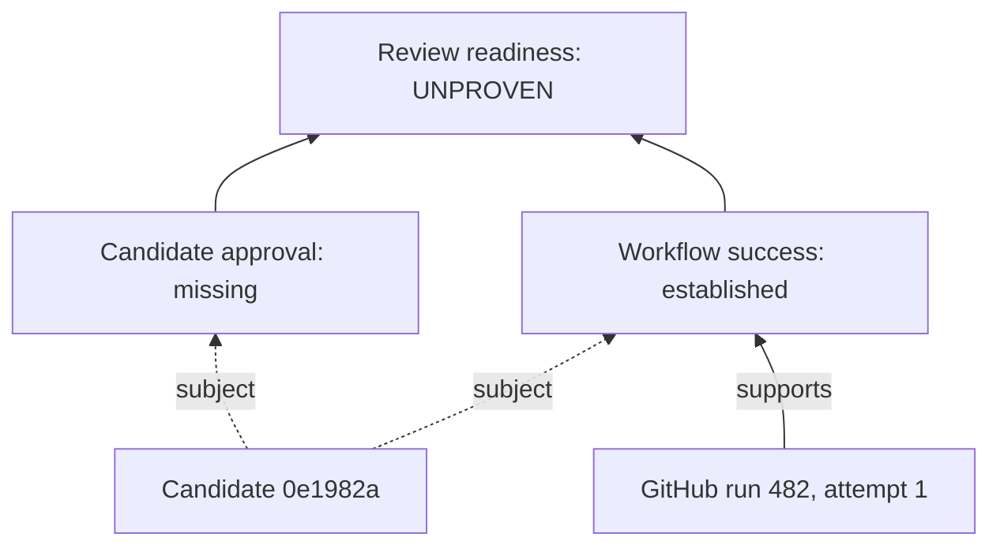

# Sykli: see what a change has established

Standalone product design · 2026-09-09 · implemented the same day as `sykli inspect` / `sykli assess`; the shipped surface is documented in [inspect.md](inspect.md), and the outputs below were written before implementation

Named user and first workflow: Yair, inspecting a Sykli pull request such as
PR #25, then handing its unresolved requirements to another worker. This design
supersedes the product ownership, CLI and MVP recommendation in the
[earlier investigation](obligation-acceptance-design.md). That investigation's
code analysis and trust limits still apply.

## Product decision

**Sykli connects a particular change to its completion requirements and the
evidence available from existing tools. It explains what is established and
what remains.**

Install one open-source Rust CLI. Use existing CI workflows and review tools.
Humans and agents receive the same assessment. No False Systems component,
account, hosted service, agent SDK or workflow rewrite is required. GitHub CLI
is the initial transport dependency; offline assessment needs only Sykli and a
saved bundle.

The first product is read-only and advisory. It neither merges nor deploys nor
certifies that GitHub's entire merge policy has been met. It establishes only
the explicitly named conditions, under visible trust assumptions. Enforcement
is a later deployment of the same evaluator in a protected environment.

The useful distinction from a CI dashboard is the pinned question: which
requirements concern this candidate, what supports each answer, and why does
an observation count? The useful distinction from a runner is that Sykli does
not choose or execute the work. These benefits must be demonstrated against
ordinary `gh` commands before expanding the product.

## First experience

All commands and outputs below are proposed. IDs and statuses are illustrative;
no GitHub evidence was collected for PR #25 while writing this design.

```sh
sykli inspect --repo false-systems/sykli --pr 25
```

```text
false-systems/sykli #25 at 0e1982a…

Observed
  CI / attempt 1: GitHub reports success
  Review: no qualifying approval observed

Requirements: not configured
Saved observations: .sykli/evidence/<collection-id>
```

No configuration is required to see observations. Without requirements there
is no completion verdict. Workflow names do not imply tests, coverage or safety.

The maintainer writes or approves a compact requirements file. Inspection can
show exact workflow/account IDs needed to author it; a model can draft it. Sykli
does not automatically ratify that draft or silently import all GitHub rules.

```sh
sykli assess .sykli/evidence/<collection-id> \
  --requirements /trusted/config/sykli-review.json
```

```text
0e1982a… — UNPROVEN
Scope: declared review-readiness conditions; advisory

✓ ci      GitHub reports success for required workflow
? review  No allowed reviewer has approved this candidate

Evidence window: 14:32:01–14:32:04 UTC
Trust: local collector and store; receipt is not authenticated
Details: sykli assess <bundle> --requirements <file> --why review
```

After review, run inspection again. This creates a new immutable collection;
assessment uses it without changing the previous result. If the PR head changed,
the new collection names a new candidate. There is no hidden mutable `current`
record that can repoint a saved assessment.

## Two commands, three views

| Command | Behavior |
|---|---|
| `inspect --repo OWNER/REPO --pr N [--requirements FILE]` | Explicit live, read-only acquisition. Saves a bounded evidence bundle and shows observations. With requirements, also assesses them. |
| `assess BUNDLE --requirements FILE [--at TIME]` | Offline validation and deterministic assessment. Default evaluation time is the collection's end, printed prominently; `--at` makes a different time explicit. |

Both support `--json`: one versioned result on stdout, no embedded logs. Assessment
also supports `--graph mermaid`, mutually exclusive with `--json`, and `--why ID`
for an obligation's supporting, excluded and missing evidence. Detailed API
diagnostics are referenced files, opened explicitly; no raw responses, tokens or
command output mixed into normal output. Fatal errors carry stable codes; their
human rendering goes to stderr, with JSON error documents on stdout in JSON mode.

Inspection without requirements exits 0 when a valid snapshot of observations
was saved, even if it records provider gaps. With requirements, inspection and
assessment exit 0 for established, 1 for refuted, 3 for unproven, 4 for conflict,
and 2 for invalid input or tool failure preventing a valid assessment. JSON always
distinguishes `observations-only` from an assessment. Existing commands and exit
codes do not change.

There is no separate `next` command: unresolved nodes already carry reason codes,
evidence requirements and source locators. An agent chooses actions using those
facts. Sykli supplies no model-generated shell commands or automatic retries.

## A small graph of reasons



Arrows mean support or required conditions, never scheduling order. Graph nodes
and text/JSON rows come from one assessment structure. Each obligation has a
stable ID, exact subject, result, support/counterevidence references, exclusions,
missing-evidence reason and rule version. Labels are escaped before Mermaid
rendering. The initial graph is a shallow projection, with no graph editor,
arbitrary condition nesting or separate graph database.

For this commit, “bug reproduced on parent” and “regression test passed on
candidate” are stronger, useful future nodes. Existing workflow success alone
cannot establish them. They remain unsupported until a reader can bind the
actual test implementation and outcomes to both revisions.

## Four persistent concepts

| Object | Contents and identity |
|---|---|
| Requirements | Versioned owner-chosen predicates and source bindings. Content-addressed; file paths are locators. No executable expressions. |
| Request | Canonical repository identity, PR number, head repository/commit/tree, base repository/commit, purpose and requirements digest. Changing any binding creates a new request. |
| Collection | Raw responses, fixed query selectors, reader version, acquisition interval, completion/gaps and normalization references. Retrieval instance ID differs from raw content hashes. |
| Assessment | Request ID, collection manifest digest, evaluation time, rule version, trust designation and per-condition results. Receipt is its serialization, not a separate source of truth. |

Inspection without requirements creates a candidate description and collection;
assessment binds that description to requirements to form the request. Save the
full requirements bytes with the assessment. A fresh worker needs the bundle and
approved requirements, not a prior conversation. Live refresh additionally needs
provider access.

Illustrative authoring shape; numeric IDs are placeholders, not actual repository
or workflow IDs:

```json
{
  "schema": "sykli-requirements.v1",
  "purpose": "review-readiness",
  "repository": {"host": "github.com", "id": 123},
  "max_observation_age_seconds": 300,
  "requirements": {
    "ci": {
      "kind": "workflow-reported-success",
      "source": {"provider": "github", "workflow_id": 456, "event": "pull_request"},
      "selection": "latest-run-latest-attempt"
    },
    "review": {
      "kind": "candidate-approval",
      "source": {"provider": "github"},
      "allowed_user_ids": [789],
      "minimum": 1,
      "exclude_pr_author": true
    }
  }
}
```

Reject duplicate keys, empty requirement sets, unknown kinds/fields, invalid IDs,
nonpositive age bounds and unsupported selection rules. Canonical semantic JSON
uses sorted maps, canonicalized set-valued IDs, integer control values and
explicit defaults. Domain-separated SHA-256 follows existing Sykli conventions;
new schemas have distinct domains. Never change existing receipt identities.

Rules and source bindings are separate in meaning even when adjacent in the
file. Replacing GitHub with CircleCI may preserve the workflow-success predicate,
but changes the approved requirements digest and creates a new request. Stronger
claims such as “suite Q passed on C” need equivalent measurement on both systems;
a normalized green status is not that equivalence.

## GitHub reader: precise first semantics

The reader uses approved `gh api` invocations with explicit GET, fixed host,
structured arguments and bounded output. It does not execute a shell, load an
emitter or run any candidate code. Resolve the repository by API identity, not
only `owner/name`. A fork head's repository is distinct from the base repository.
Initial support is github.com; other hosts return unsupported until tested.

Read the PR before acquisition, fetch the requested run/review scope, and read
it again afterward. Head/base changes produce `candidate-moved`; refresh is an
explicit next invocation. This detects observed changes, not an atomic GitHub
snapshot. Runs/reviews can change too: re-read selected run state/attempt and the
review list at the end. Detected races become a gap, never a convenient selection.
Always label the acquisition interval, not “true right now.”

### Workflow-reported-success

1. Enumerate the workflow's runs for the exact candidate association and allowed
   event. Check repository identity, workflow ID, head repository/commit and PR
   association where supplied. Missing association is unproven, not guessed from
   branch name. Initially support ordinary `pull_request`; `pull_request_target`,
   merge queues and arbitrary dispatch events are unsupported for this predicate.
2. Do not filter queries to successful or completed runs. Within the selected
   workflow/candidate/event, choose the greatest run number, then that run's
   latest reported attempt. Validate identity/order consistency; ambiguous
   ordering or incomplete enumeration is unproven.
3. A completed `success` satisfies this narrow provider-report predicate.
   `failure` refutes it. In-progress, queued, canceled, skipped, neutral,
   timed-out, action-required or unknown outcomes are unproven with the actual
   provider outcome retained. An old green cannot hide a newer unresolved run.
4. Keep earlier failures and attempts in the manifest. A subsequent pass may
   satisfy this selected-attempt rule; it does not establish absence of flakiness.
5. Job results are available as drill-down observations. Workflow success does
   not establish that every job/test ran, especially skipped or allowed-failure
   jobs. There is no job-name-to-test inference in v1.

GitHub exposes run identity, associated head, event, run number and attempt.
Its filtered run listing can be capped at 1,000 results. Complete pagination
alone therefore is insufficient at a cap; mark coverage uncertain instead of
claiming to have found every applicable run. See [workflow API](https://docs.github.com/en/rest/actions/workflow-runs).

**Critical scope:** an associated PR head is not necessarily the executed checkout.
Our own [CI workflow](../.github/workflows/ci.yml) uses checkout and builds the
candidate's Sykli Action. Provider success cannot authenticate the candidate's
own success narrative or prove which tests it actually exercised. The first
reader records that limit; exact tested-tree/suite evidence is a later predicate.

### Candidate-approval

Use complete review records with exact `commit_id`, stable reviewer ID, state,
submission time and dismissal information. Comments are not approvals. The
GitHub [review API](https://docs.github.com/en/rest/pulls/reviews) exposes these
core review fields; the rule below is Sykli's proposed requirement, not an
implementation of all GitHub branch-protection semantics.

For each allowed reviewer, exclude pending/comment-only entries and select their
latest decisive submitted record in the PR. An approval counts only if it is
undismissed, refers to this candidate and passes the author exclusion. A later
changes-requested record blocks that reviewer's approval; an active
changes-requested record from any allowed reviewer refutes the requirement.
A dismissed latest record contributes no approval and must not resurrect an
older approval. If ordering or current dismissal state is ambiguous, return
unproven. Unsupported review states are explicit gaps.

Require the configured number of distinct qualifying reviewers and no active
allowed-reviewer change request. No qualifying approval is unproven. Stable user
IDs establish account identity, not human independence: the operator must ensure
that allowed accounts are not controlled by the claimant. Team membership,
CODEOWNERS, bypass privileges and all mergeability rules are outside v1.

### Transport and collection limits

Private repositories need credentials with the relevant read access. Use the
operator's existing `gh` authentication; never persist credentials. Document
needed permissions per endpoint. Do not trigger workflows, post checks/comments,
request reviews, rerun jobs or mutate repository settings.

The [GitHub CLI API command](https://cli.github.com/manual/gh_api) supports
authenticated requests and pagination. The reader must still impose time,
page-count and byte limits, record endpoint status and incomplete responses, and
reject unexpected redirects/hosts. No user-supplied executable or arbitrary URL
fetching. Request headers and error output are sanitized before storage.

## Evidence, truth and authority

Three levels must be visible:

* **Provider report:** GitHub says a run succeeded or an account approved C.
* **Sykli assessment:** those reports satisfy the specified finite predicates.
* **Owner authority:** an authorized consumer decides whether that assessment
  permits an action. Sykli v1 supplies no merge/deployment authorization.

The first local bundle trusts the installed collector and its storage. Raw API
responses are not provider-signed portable testimony. Hashes detect accidental
change, not a malicious user replacing the entire bundle and its hashes. JSON
must include `trust: trusted-local-collector-and-store`,
`authenticity: not-established`, and `mode: advisory`. Offline output explicitly
says it is replaying supplied evidence. It must never claim an independent issuer
merely because it replayed a valid JSON schema.

An agent cannot supply a `complete` flag as a request API. However, a same-user
agent can tamper with local files. Honest product wording must distinguish these
facts. Independent enforcement later requires a protected evaluator/collector,
protected requirements and an authenticated receipt or direct protected consumer.
The first release does not advertise adversarially secure acceptance.

Requirements in a candidate checkout are proposals. An authoritative deployment
loads them from an operator-controlled path or approved pinned revision, together
with its expected digest. It never loads policy, `gh`, credentials, PATH helpers
or plugins from candidate-controlled locations. Local advisory mode displays the
chosen requirements digest and makes no claim that someone ratified it.

No required signing dependency or custom PKI in the first slice. Sauma, Kelpo,
Teko and Taso can later consume explicit contracts; none is installed or invoked
for basic use. Reusing existing standards does not require the family.

## Result rules and persistence

Per obligation: `satisfied`, `refuted`, `unproven`, `conflict`. Missing, stale,
unsupported, provider-unavailable, wrong-subject, selection-incomplete and
candidate-moved are reason codes under unproven. Invalid request/bundle structure
is a tool error, never a positive result. Inapplicable evidence is retained as
excluded; it does not count as counterevidence.

Aggregate: conflict if any required node conflicts; otherwise refuted if any is
refuted; otherwise established if all are satisfied; otherwise unproven. Include
all node results regardless of precedence. Execution failures and uncertainty
remain distinguishable even when both prevent establishment.

Two differing observations at different times may describe real change. Distinct
attempts are history, not a conflict. Contradiction means incompatible admitted
claims about the same subject/event at the relevant cut, unresolved by the source
rule. Preserve both; no voting or confidence score.

The same requirements, bundle, rule version and evaluation time give the same
result. Replay at collection end explains the historical decision. Assessing at
a later explicit time can make evidence stale. No receipt is permanently current:
a merge consumer must reacquire candidate/review/run state and enforce its own
preconditions. A five-minute age allowance is not proof nothing changed within
those five minutes.

Use `.sykli/evidence/` or explicit `--store DIR` with immutable manifests and
content-addressed response objects. New collections append, with optional
`previous_collection` references. Save the requirements, request and assessment
alongside them. Atomic publication and digest checks prevent torn writes from
creating completion. Incomplete collections deliberately retain gaps. Concurrent
readers can create independent collections; no authoritative execution lease or
job claiming exists. Do not download CI logs/artifacts by default.

Minimal JSON result shape, illustrative abbreviated references:

```json
{
  "schema": "sykli-assessment.v1",
  "request": "sha256:REQUEST",
  "collection": "sha256:MANIFEST",
  "requirements": "sha256:REQUIREMENTS",
  "candidate": {"repository_id": 123, "head": "FULL_COMMIT", "base": "FULL_BASE"},
  "result": "unproven",
  "obligations": {
    "ci": {"result": "satisfied", "support": ["sha256:RUN"], "reason": "provider-reported-success"},
    "review": {"result": "unproven", "support": [], "reason": "approval-missing"}
  },
  "evaluated_at": "2026-09-09T14:32:04Z",
  "evaluator": "review-readiness.v1",
  "trust": "trusted-local-collector-and-store",
  "authenticity": "not-established",
  "mode": "advisory"
}
```

The complete schema also retains counterevidence, exclusions, query coverage,
requirements origin and limitations. Raw retained evidence has endpoint and
field references so an explanation is reproducible without an LLM. Raw content
can contain private repository data: keep local storage private and do not
silently upload bundles or include auth material.

## Implementation shape and compatibility

Three modules are enough initially; no provider trait until a second reader
demonstrates the shared boundary:

| Proposed module | Responsibility |
|---|---|
| `src/assessment.rs` | Finite requirements/request/result types, validation, canonical identities, pure evaluation and graph projection. |
| `src/github.rs` | Bounded GET collection and normalization with raw-field references. No verdict authority or action execution. |
| `src/evidence.rs` | Immutable bundle publication/loading, reference checks and private diagnostic files. |

Integrate `inspect`/`assess` in the existing CLI. They do not conflict with current
`status` (production), `plan` (work graph), or `verify` (legacy receipts).
Reuse strict JSON/canonical helpers from
[`production/contract.rs`](../src/production/contract.rs) and the small atomic
publication pattern from [`production/store.rs`](../src/production/store.rs).
Extract only helpers actually shared; do not import the production scheduler or
artifact type system into assessment. Preserve existing identity domains.

Keep current graph execution, cache and typed production behavior for existing
users during the trial. A local production receipt remains local execution
evidence, never automatically independent CI evidence. Decide later whether the
runner remains useful; no wholesale rename or legacy schema reinterpretation.

This direction changes the current offline-only boundary in AGENTS.md and the
scope of [ADR-0005](adr/0005-deletions.md). An implementation PR must explicitly
amend them: on-demand read-only acquisition is now owned; servers, webhooks,
coordination, model execution and provider mutations remain excluded. The named
workflow is candidate review readiness, which command exit status cannot alone
establish. This document is a design proposal, not a silent amendment to those
rules or authorization to modify sibling repositories.

## Delivery sequence and checks

1. Build the pure evaluator and versioned schemas for the two finite predicates.
   Saved realistic API responses exercise exact bindings before network code.
2. Add bounded live GitHub inspection and bundle persistence using `gh`.
3. Add human/JSON/graph rendering from the same result and explain reasons.
4. Demonstrate against our PR with its existing CI unchanged. Record actual
   observations; do not fabricate review/test evidence to make the demo green.
5. Have a fresh client replay the bundle and refresh it. Change the candidate in
   a disposable test PR only with separate authorization; deterministic local
   fixtures cover that transition without mutating real PRs.

Required tests combine real risk scenarios, not a struct-field checklist:

| Scenario | Expected behavior |
|---|---|
| Green run for old SHA, wrong fork or wrong workflow with same name | Excluded; cannot satisfy current candidate. |
| Older green, newer pending/failed/canceled run or rerun | Select current lineage; no convenient historical green. |
| Green workflow with skipped tests | Establish only provider-reported workflow success, never tests executed. |
| Approval on old candidate, later changes requested, dismissal, self-review | Apply exact review selection; cannot count stale/revoked/ineligible approval. |
| API permission failure, pagination cap, partial list, unknown status | Explicit unproven gap; no silent empty-success result. |
| Candidate/run/review changes during collection | Flag race; no claim of atomic observation. |
| Same evidence supplied in different order | Same assessment and graph after canonicalization. |
| Tampered response or torn bundle publication | Reject invalid references; never invent completion. Recomputed hashes remain outside local authenticity guarantees. |
| Agent submits `complete: true` or lowers requirements | Reject unsupported request fields; changed rules have a new identity and no implicit approval. |
| Saved bundle replayed after freshness limit | Historical replay labeled as such; later-time assessment unproven. |
| Fresh worker, no original chat or memory | Same bundle replays identically, missing work is intelligible. |
| CLI transport audit | No provider mutation, candidate execution, mixed logs/JSON or credential persistence. |

Run the existing repository gate as well; new assessment logic must not break
legacy run/production paths. First release documentation starts with inspection
and shows the advisory trust limit before claiming independent enforcement.

The trial succeeds if a maintainer can answer “why is this candidate not ready?”
without manually joining run attempts, reviews and revisions, and the next worker
can continue from those facts. Compare setup and explanation quality against
`gh pr checks`, `gh pr view` and a short script. If Sykli merely republishes their
statuses with more configuration, stop and simplify.

## What comes afterward

First add a second provider's evidence to test whether predicates remain clear.
Do not advertise support for “any CI” before its evidence semantics are tested.
Then consider protected assessment consumption, authenticated provenance and
source-to-artifact requirements. Deployment observations and runtime behavior
come only after those bindings work.

The next implementation is therefore a standalone read-only candidate assessor,
not a new execution backend. The larger goal remains an inspectable account of
what a change has earned, with every conclusion limited to its actual evidence.
